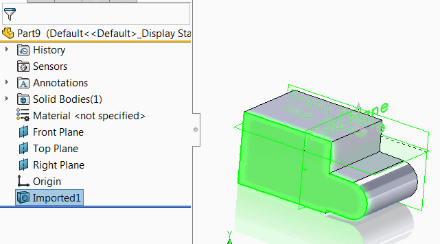

在使用SOLIDWORKS API开发宏和应用程序时，跟踪ID用于在几何操作（如合并、相减、复制、分割、模式）中映射（跟踪）实体。

跟踪ID可以应用于面、边、环、顶点和实体。

跟踪ID在模型重建之前是临时分配的。

主要用于临时实体的操作时，当需要跟踪特定元素时，当实体发生变化时。通常在宏特征中需要这样做。

以下示例演示了使用SOLIDWORKS API中的跟踪ID来跟踪和映射用户选择的面到复制的合并实体。

* 下载[示例文件](tracking-ids-sample.SLDPRT)或使用其他零件文档
* 选择至少一个面。建议选择至少两个来自不同实体且重叠的面。这样可以演示跟踪ID的好处，因为实体将被合并。
* 运行宏。

{ width=300 }

宏将执行以下步骤

* 收集所有选择的面
* 从选择的面中找到所有实体
* 清除所有现有的跟踪ID（如果有）
* 复制实体
* 将所有实体合并为一个
* 创建新的零件文档
* 从合并的副本创建新的实体
* 找到与最初选择的面对应的面
* 在合并的实体中选择这些对应的面

{ width=250 }

