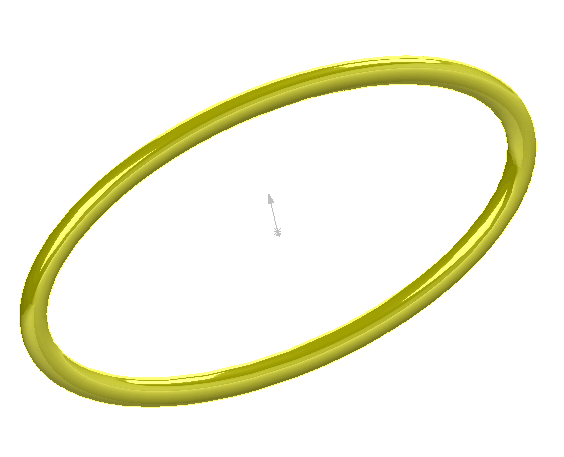

{ width=250 }

本示例演示了如何使用SOLIDWORKS API将圆形剖面沿椭圆路径扫描以创建临时体。

[SOLIDWORKS API方法IModeler::CreateSweptBody](https://help.solidworks.com/2012/english/api/sldworksapi/SOLIDWORKS.Interop.sldworks~SOLIDWORKS.Interop.sldworks.IModeler~CreateSweptBody.html)要求预先选择剖面和路径，这意味着无法使用曲线进行扫描操作。

但是，宏演示了如何从临时线体中创建边缘。

使用[仅用于API的对象选择](/solidworks-api/document/selection/api-only-selection/)技术可以在不显示任何线体且图形区域中没有可见选择的情况下创建扫描体。所有用户选择也将被保留。

* 打开零件文档
* 可选择任何对象（这不会影响扫描操作）。
* 运行宏。宏将显示临时体，所有用户选择的对象都将被保留。
* 宏停止执行
* 继续宏以隐藏预览

