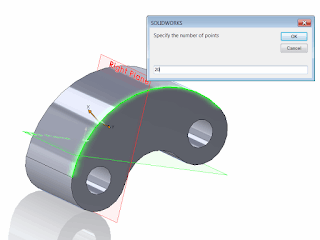

通过SOLIDWORKS API在所选边上创建草图点

这个宏使用SOLIDWORKS API在3D草图中的所选边上创建指定数量的草图点。

1. 打开SOLIDWORKS零件
2. （可选）打开3D草图以在现有草图中插入点，否则将创建新的草图
3. 运行宏。输入要生成的点的数量

结果是在3D草图中生成了指定数量的草图点：

{ width=320 height=239 }

另外，也可以根据曲线长度创建点。以下示例将通过计算曲线细分点的近似长度来创建点：



或者根据总曲线长度计算距离来创建点：

