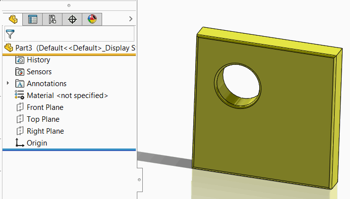

这个VBA示例演示了如何将所选实体的副本存储在新文档的流中，并在模型打开时恢复和显示该实体。

实体通过[第三方存储](/solidworks-api/data-storage/third-party/)进行序列化和反序列化。

* 创建新的宏并添加新的窗体。将其命名为*UserForm1*（默认名称）
* 添加按钮。如下图所示，指定标题为*存储实体*，名称为*cmdStoreBody*

{ width=450 }

* 将以下代码粘贴到用户窗体的代码后面：



* 将以下代码插入到宏的主模块中：



## 运行宏

* 从主模块启动宏。注意，如果在宏编辑器中激活窗体时运行宏，窗体将显示为模态窗口，并阻止选择和保存操作。
* 打开任何带有任意几何图形的零件文档
* 从树中选择实体，并在用户窗体中点击*存储实体*
* 创建新的零件文档，并显示以下消息：*保存此文档以将实体存储在其流中*
* 保存此文件。在保存文件时，来自不同零件的实体被序列化到新文档的流中，并且不再与原始实体相关联。
* 完成后，显示以下消息：*实体已存储到模型流中。关闭并重新打开模型以恢复实体*
* 现在，关闭所有文档并重新打开最后保存的文件。实体将被反序列化并显示出来。请注意，模型中没有特征树。

{ width=350 }

* 您可以关闭SOLIDWORKS会话并重新打开模型。实体仍将被加载。请注意，在打开模型之前，您需要运行宏。