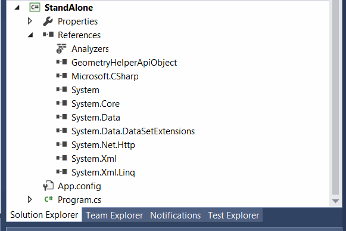
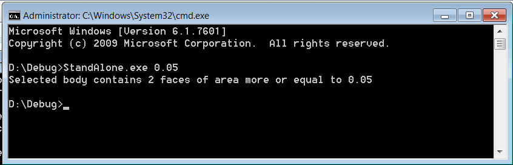

通过运行对象表（ROT）调用SOLIDWORKS插件的函数

本文提供了详细的逐步说明，介绍了如何通过运行对象表（ROT）从独立应用程序或脚本中调用SOLIDWORKS插件的函数。这可以被视为在插件本身中启用应用程序编程接口（API）。

这种方法允许通过从进程ID中提取它来连接到API对象。这种方法的主要好处之一是能够在不直接使用任何SOLIDWORKS API命令甚至添加SOLIDWORKS类型库或互操作的情况下控制插件API。

在这个例子中，SOLIDWORKS插件允许计算所选体的面数。它提供了一个菜单供用户点击。

{ width=350 }

结果显示在消息框中。

{ width=450 }

插件还提供了一个供第三方调用的API对象。API扩展了UI的功能，并允许传递参数以过滤面的最小面积。

API方法和用户界面命令处理程序都调用同一个函数。

这是插件和API对象的解决方案树。GeometryHelperApiObject编译为dll，并包含插件接口的定义。它不包含任何实现，并且不引用任何SOLIDWORKS互操作。这个dll被引用在实现API对象的SOLIDWORKS插件项目中，并且也将被所有第三方应用程序引用以访问API。因此，没有第三方应用程序需要引用启用抽象级别的主插件dll。

{ width=450 }

请浏览下面的源代码和解释，了解如何实现这个框架的更多细节。

## GeometryHelperApiObject项目

该项目包含应该由插件公开的API方法和接口的定义（签名）。

### GeometryHelperApiObjectFactory.cs

这是一个帮助COM对象，它将简化从进程中检索API对象实例的访问。它负责通过其ID从进程中检索API对象的实例。



### IGeometryHelperApiObject.cs

这是向第三方应用程序公开的API的接口。在这个例子中，该函数将根据面积过滤器返回面的数量。



## GeometryHelperAddIn项目

这个项目是一个SOLIDWORKS插件。在这个例子中，它使用[SwEx.AddIn Framework](/labs/solidworks/swex/add-in/)进行开发，但任何其他框架或SDK都将得到支持。

### GeometryHelperService.cs

插件内的帮助类，用于调用SOLIDWORKS API来计算所选体的面数，基于最小面积。



插件必须实现API对象的功能。有两种常见的方法。

* 通过在继承类中直接实现功能，如下所示

### GeometryHelperApiObject.cs

API对象的实现在其类中直接使用SOLIDWORKS API来处理请求并提供API调用的响应。



### MainAddIn.cs

这是主SOLIDWORKS插件类的实现。将用于处理功能的服务直接传递给API对象实现，并从那里调用以处理API调用。



* 通过实现代理API对象。这种方法可能被认为更有益和安全，因为它不会在其结构中暴露任何内部对象。所有的请求都在代理类的外部处理。

### GeometryHelperApiObjectProxy.cs

代理对象不包含对插件的任何对象的引用。相反，它将生成请求事件，由插件处理和处理。



### MainAddIn.cs与代理API对象

在插件中处理事件并提供结果。



### RotHelper.cs

为了使API对象可用，需要在运行对象表（ROT）中注册它。这个辅助类允许按名称注册对象。



## 从独立应用程序调用API

现在可以从任何兼容COM的编程语言调用插件API。

### VBA宏

从Excel VBA宏中调用API的示例。

{ width=450 }

添加对类型库的引用以启用调用的[早期绑定](/visual-basic/variables/declaration#early-binding-and-late-binding)。

{ width=450 }

宏通过其Prog ID创建Factory对象的实例，并通过进程ID检索API对象的实例。



### C#控制台应用程序

从C#控制台应用程序中调用API的示例。

如下所示，只需要添加对包含接口定义的API对象dll的引用。不需要添加任何其他引用（包括插件dll或任何SOLIDWORKS互操作）。

{ width=450 }

API调用的结果将打印到控制台窗口中。

{ width=450 }



> 无法从运行对象表（ROT）中检索对象（即返回null）的最常见原因是运行SOLIDWORKS和独立应用程序的帐户级别不同。例如，SOLIDWORKS以管理员身份运行，而独立应用程序不是，反之亦然。这是Windows的限制，需要以相同的权限级别运行两个应用程序以启用通信。

在[GitHub](https://github.com/codestackdev/solidworks-api-examples/tree/master/swex/add-in/geometry-helper-api-rot)上下载源代码。