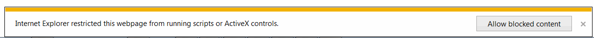

标题：使用SOLIDWORKS API在HTML页面中渲染特征树
说明：示例演示了如何使用SOLIDWORKS API和JavaScript以及Internet Explorer中的ActiveX控件将SOLIDWORKS零件文档的特征树提取并渲染到HTML页面中。
图片：html-feature-tree-rendered.png
标签：[JavaScript, 特征管理器]

这个示例演示了如何使用SOLIDWORKS API将SOLIDWORKS零件文件的特征树内容加载到HTML页面中，使用JavaScript和Internet Explorer中的ActiveX（这将不适用于其他浏览器，因为默认情况下不支持ActiveX，可能需要安装特殊插件来启用支持）。

- 创建一个新的HTML文件
- 将以下代码复制粘贴到文件中


- 保存文件并在MS Internet Explorer中打开

由于此页面使用了ActiveX，可能会显示以下消息：

点击“允许阻止的内容”按钮

- 在文本框输入字段中输入SOLIDWORKS零件的完整路径

- 点击“获取特征树”按钮

- 在弹出窗口中点击“是”

{ width=350 }

结果，零件的特征树将在页面上呈现出来

{ width=250 }