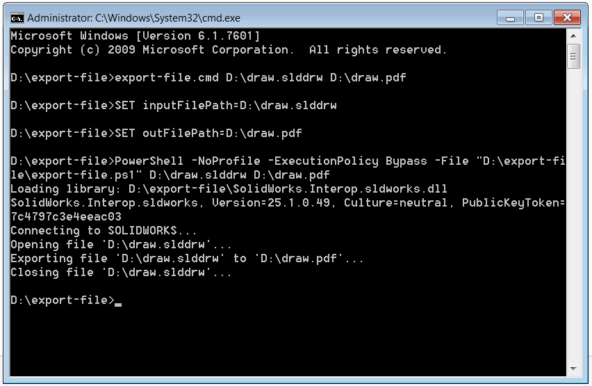

这个PowerShell脚本允许使用SOLIDWORKS API从命令行将SOLIDWORKS文件导出为指定的外部格式。

## 配置和使用说明

* 创建两个文件，并从下面的代码片段中粘贴代码

### export-file.ps1


### export-file.cmd


* 将*SolidWorks.Interop.sldworks.dll*复制到创建上述脚本的文件夹中。PowerShell脚本基于.NET Framework 2.0，因此SOLIDWORKS interop必须针对此框架。该dll可以在以下位置找到：**SOLIDWORKS安装文件夹**\api\redist\CLR2\SolidWorks.Interop.sldworks.dll

{ width=450 }

或者可以指定SOLIDWORKS interop的完整路径，如下所示。在这种情况下，不需要将此dll复制到脚本文件夹中。

~~~ ps1
$Assem = ( 
   "SolidWorks.Interop.sldworks.dll的完整路径"
    ) 
~~~

* 启动命令行并执行以下命令

~~~ bat
[export-file.cmd的完整路径] [输入SOLIDWORKS文件的完整路径] [输出文件的完整路径和扩展名]
~~~

结果文件将被导出，并且进程日志将直接显示在控制台中：

{ width=450 }