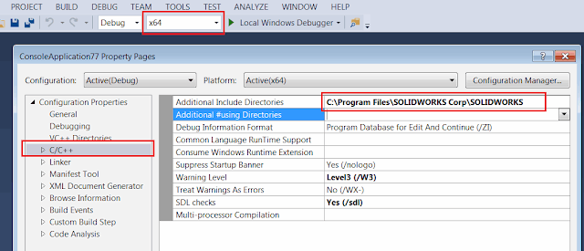

在本教程中，我将演示如何使用C++和Microsoft Visual Studio从外部进程（即独立应用程序，如MFC、Win32控制台应用程序）连接到SOLIDWORKS应用程序。

有关本文讨论的方法的更详细解释，请参阅[从独立应用程序连接到SOLIDWORKS](/solidworks-api/getting-started/stand-alone/)文章。

## 创建新项目

我将使用Microsoft Visual Studio开发环境。您可以使用任何版本的Visual Studio。
相同的代码将适用于专业版、Express版或Community版。请点击此链接下载[Visual Studio](https://www.visualstudio.com/vs/community/)

* 打开Visual Studio
* 开始新项目：

{ width=400 }

* 选择项目模板。我建议从Win32控制台应用程序项目模板开始，因为它包含最少的预生成代码：

{ width=640 }

* 在项目向导中勾选ATL选项

{ width=640 }

* 链接SOLIDWORKS类型库所在的目录。
这是SOLIDWORKS的安装目录（转到项目属性，选择C/C++，在“附加包含目录”字段中浏览路径）：

{ width=640 }

现在我们可以添加连接到SOLIDWORKS实例的代码。

## 创建或连接实例

连接到COM服务器最常见且最快速的方法是使用[CoCreateInstance](https://msdn.microsoft.com/zh-cn/library/windows/desktop/ms686615(v=vs.85).aspx)函数。



## 通过ROT获取运行实例

为了连接到已经运行的特定SOLIDWORKS会话或能够创建多个会话，可以使用Running Object Table（ROT）API。
有关此方法的更多详细信息，请阅读[从独立应用程序连接到SOLIDWORKS](/solidworks-api/getting-started/stand-alone#method-b---running-object-table-rot)文章。



在上面的示例中，通过从SOLIDWORKS应用程序安装路径启动新进程来启动新的SOLIDWORKS会话。
*ConnectToSwApp*函数需要**sldworks.exe**的完整路径作为第一个参数，并且以秒为单位的超时时间作为第二个参数。
超时时间将确保应用程序在进程启动失败的情况下不会被锁定。