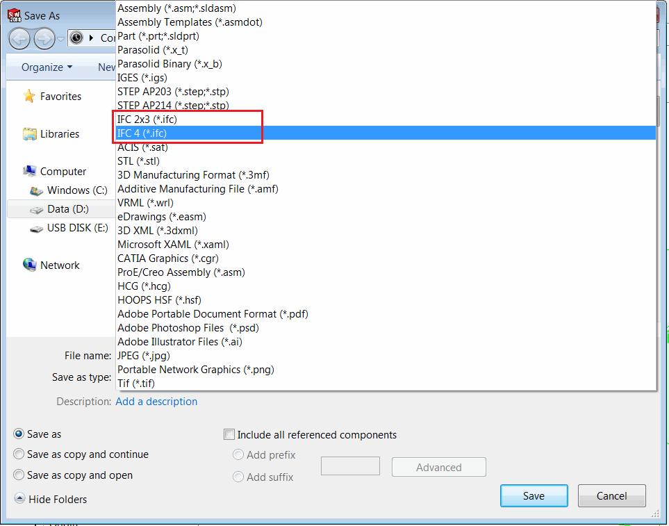
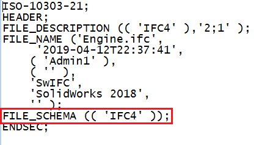

此示例演示了如何使用 SOLIDWORKS API 将活动的装配体或零件文档导出为 IFC 格式。

{ width=450 }

目前 SOLIDWORKS 支持两种 IFC 格式的模式：

* IFC 2x3
* IFC 4

在文本编辑器中打开输出的 IFC 文件时，可以验证模式。

{ width=450 }

此 VBA 宏演示了如何将文件导出为两种 IFC 模式。更改 *IfcFormat_e* 枚举的值以更改格式：

~~~ vb
ExportIfc swModel, OUT_FILE_PATH, IfcFormat_e.Ifc4 '导出为 IFC 4
ExportIfc swModel, OUT_FILE_PATH, IfcFormat_e.Ifc2x3 '导出为 IFC 2x3
~~~

更改 *OUT_FILE_PATH* 常量的值以指定输出文件位置：

~~~ vb
Const OUT_FILE_PATH As String = "C:\Output\Building.ifc"
~~~

