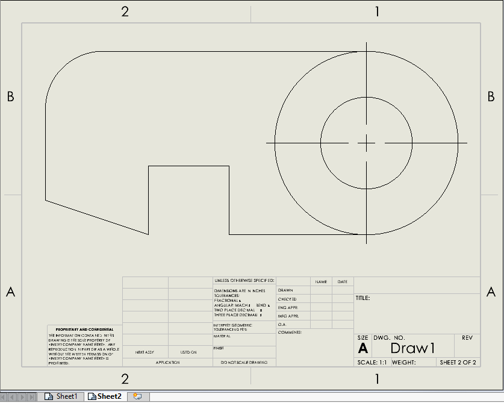

{ width=500 }

这个VBA宏允许将活动的SOLIDWORKS图纸中的所有工作表（或选定的工作表）导出为单独的PDF文件。如果没有选择工作表，则会导出所有工作表。

PDF文件保存在与原始图纸相同的文件夹中，并以工作表的名称命名。

*INCLUDE_DRAWING_NAME*选项允许在输出PDF中包含图纸的名称，如果设置为*True*，否则只使用工作表的名称。

~~~ vb jagged-bottom
Const INCLUDE_DRAWING_NAME As Boolean = True '包含图纸的名称
~~~

