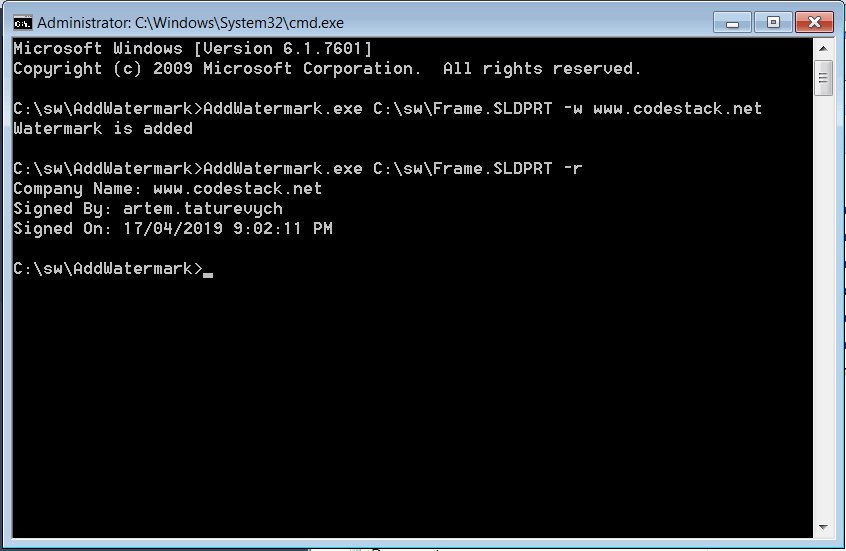

本示例演示了如何使用SOLIDWORKS Document Manager API将数字水印添加到SOLIDWORKS模型（零件、装配或绘图），并将其存储到第三方存储（流）中。

此应用程序实现为命令行程序，具有以下参数：

## 添加水印

* SOLIDWORKS文件的完整路径
* -w - 指示需要添加水印的标志
* 公司名称 - 要添加到水印中的公司名称

~~~
AddWatermark.exe C:\MyPart.sldprt -w MyCompanyName
~~~

水印将包括公司名称、当前用户名称和时间戳。

## 读取水印

* SOLIDWORKS文件的完整路径
* -r - 指示需要读取水印的标志

~~~
AddWatermark.exe C:\MyPart.sldprt -r MyCompanyName
~~~

结果将在控制台应用程序中显示存储的水印。

{ width=450 }

### Program.cs

包含读取和添加水印的控制台应用程序的路由



### ComStream.cs

封装了简化从.NET语言访问的[IStream](https://docs.microsoft.com/en-us/windows/desktop/api/objidl/nn-objidl-istream)接口

