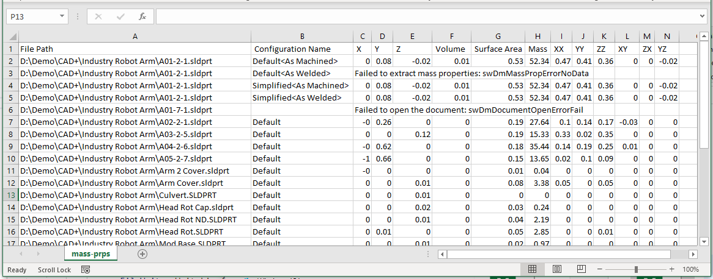

这个C#代码示例演示了如何使用SOLIDWORKS文档管理器API从输入目录中的所有文件配置中提取质量属性。

结果将输出到指定的CSV文件中，包含以下列：

* 文件路径
* 配置名称
* 重心的X坐标（米）
* 重心的Y坐标（米）
* 重心的Z坐标（米）
* 体积（立方米）
* 表面积（平方米）
* 质量（千克）
* XX转动惯量（千克·米^2）
* YY转动惯量（千克·米^2）
* ZZ转动惯量（千克·米^2）
* XY转动惯量（千克·米^2）
* ZX转动惯量（千克·米^2）
* YZ转动惯量（千克·米^2）

> 如果提取属性时出现任何错误，将输出到CSV文件中

需要指定3个命令行参数：

1. 输入目录的完整路径
2. 文件过滤器
3. 输出CSV文件的完整路径

~~~
> export-mass-props.exe "D:\输入文件夹" *.sldprt D:\mass-prps.csv
~~~

