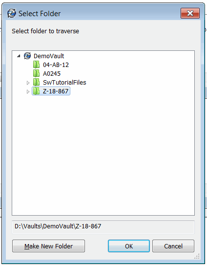

这个VBA示例演示了如何使用SOLIDWORKS PDM API在SOLIDWORKS PDM vault中递归遍历文件和文件夹。

宏显示了内置的文件夹浏览对话框，用于选择要遍历的文件夹：

{ width=250 }

宏递归遍历文件和子文件夹，并将文件或文件夹的名称、ID和级别输出到VBA编辑器的即时窗口。

{ width=350 }

即使树没有被[本地缓存](/solidworks-pdm-api/files/local-cache/)，这个宏也可以遍历树。 

