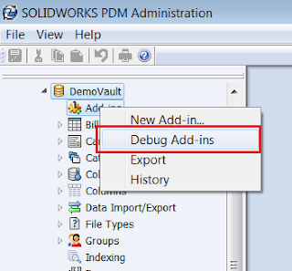
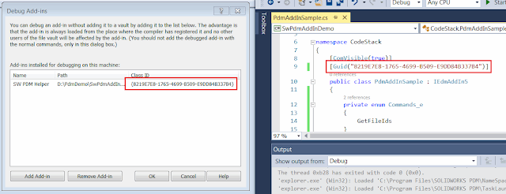
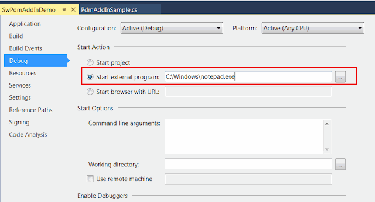
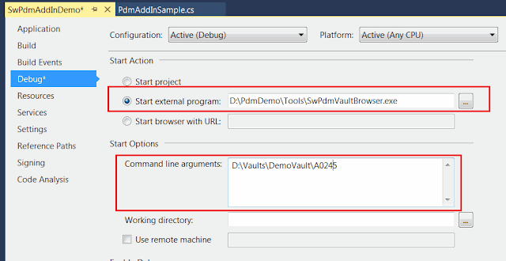

标题：调试SOLIDWORKS PDM插件 - 最佳实践
说明：详细指南，用于调试SOLIDWORKS PDM插件。使用Vault Browser工具简化调试过程。
图片：debug-addin.png
标签：[插件，API，附加到进程，调试，EPDM，示例，记事本，PDM，SOLIDWORKS PDM，Visual Studio]
重定向自：
  - /2018/03/debugging-solidworks-pdm-add-in-best.html
---
对于调试SOLIDWORKS PDM插件，许多开发人员发现这个过程繁琐且复杂。特别是如果您之前一直在开发桌面或SOLIDWORKS应用程序，现在需要开发PDM插件。

主要的复杂性来自于SOLIDWORKS PDM是一个完全集成到客户端机器上的Windows资源管理器进程的服务器-客户端系统。这意味着插件（作为进程内扩展）被加载到explorer.exe进程中。重要的是要理解，explorer.exe不仅是Windows资源管理器的进程，而且还管理开始菜单、任务栏、桌面等。因此，仅仅关闭Windows资源管理器并不能解锁插件的dll文件。

SOLIDWORKS PDM为开发人员提供了一个方便的框架，极大地简化了开发过程。您可以在*SOLIDWORKS PDM管理*控制台的vault树下的Add-ins节点下找到*Debug Add-ins*菜单。

{ width=320 height=297 }

您需要选择一个包含您的插件的dll文件来将其加载到调试器中。

{ width=640 height=246 }

一旦选择了插件，它的条目将出现在列表中，并将保留在那里，直到被移除。因此，每次重新构建项目时都不需要打开此控制台。

正如我之前所指出的，SOLIDWORKS PDM是一个客户端-服务器架构系统，所有的插件都托管在服务器上，并重新分发到客户端机器上。当将插件添加为调试插件时，这不会将插件的dll文件加载到服务器上。插件将从*bin*文件夹直接在本地进行调试。这也意味着存储库的其他用户在他们的系统中看不到这个插件。

传统上，SOLIDWORKS PDM插件是通过记事本进程进行调试的，方法是在项目的调试设置中选择记事本.exe的路径作为*启动外部程序*操作：

{ width=640 height=344 }

这样可以通过简单运行解决方案（F5）来启动调试过程，并打开记事本。为了开始实际调试，需要执行以下操作：

1. 在记事本中选择“文件”->“打开”菜单命令
1. 导航到本地存储库文件夹
1. 将过滤器更改为“所有文件（*.*）”，以查看存储库中的所有文件

{ width=400 height=271 }

这种方法的好处是，停止Visual Studio调试会话（通过在Visual Studio中点击停止按钮或关闭记事本）将释放内存中的dll文件，因此不需要重新启动explorer.exe进程来编译插件的新版本。

其限制包括：

* 无法对文件或文件夹进行多选
* 每次启动新的调试会话都需要执行太多步骤（例如，点击打开菜单，导航到存储库，更改过滤器）。每个调试会话可能需要大约5-10秒钟的时间。

更好的方法是使用[PDM Vault Browser](https://github.com/codestackdev/pdm-vault-browser/releases/tag/initial)工具。源代码可在[GitHub](https://github.com/codestackdev/pdm-vault-browser)上找到。源代码如下（必须在.NET Framework 4.0中编译，否则将无法加载调试符号）：



这个工具是一个简单的文件浏览对话框，启用了多选选项。该工具还接受一个命令行参数，其中包含PDM存储库中文件夹的完整路径。因此，当启动时，它将自动浏览到指定的文件夹：

{ width=640 height=328 }

现在，当启动调试器时，它将自动将您带到存储库中的指定文件夹，无需指定过滤器。

视频演示：



PDM插件的示例。请阅读[如何创建SOLIDWORKS PDM Professional插件](/solidworks-pdm-api/getting-started/add-ins/create/)文章，了解如何从头开始构建PDM插件。

C#示例



VB.NET示例



