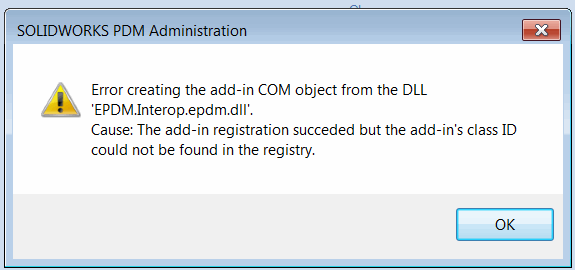
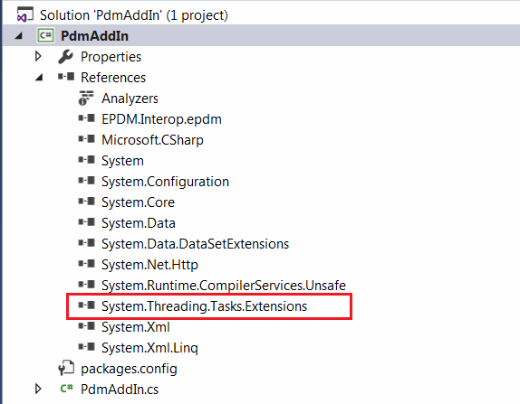

## 症状

通过PDM管理工具将.NET插件添加到保险库时，会显示以下错误：*从dll 'name.dll'创建插件COM对象时出错。原因：插件注册成功，但在注册表中找不到插件的类ID*

{ width=450 }

在[调试](/solidworks-pdm-api/getting-started/add-ins/debugging-best-practices/)时，插件正常工作。

## 原因

如果项目使用与SOLIDWORKS PDM不兼容的库，就会出现此错误。例如，[System.Threading.Tasks.Extensions](https://www.nuget.org/packages/System.Threading.Tasks.Extensions/)会导致此问题。即使dll在项目中未使用，但只要存在于文件夹中，问题就会重现。

{ width=450 }

## 解决方法

* 找到有问题的dll。注意，建议清除bin（输出）文件夹，因为该dll可能不再在项目中使用，但仍然存在于输出文件夹中。
    * 可能需要逐个注释代码并逐个删除引用，以找到导致问题的dll
* 找到后，检查如何避免使用此dll。该库可能是另一个包的一部分，不一定需要在插件项目中。例如，[System.Threading.Tasks.Extensions](https://www.nuget.org/packages/System.Threading.Tasks.Extensions/)可以作为单元测试框架[Moq](https://www.nuget.org/packages/Moq/)的一部分添加到项目中。单元测试二进制文件不应编译到目标插件输出文件夹中。
* 如果无法避免使用该dll，另一种方法是将dll添加为资源文件，并在插件加载时动态复制该dll，并使用[AppDomain::AssemblyResolve](https://docs.microsoft.com/en-us/dotnet/api/system.appdomain.assemblyresolve?view=netframework-4.8)通知来正确解析运行时引用。