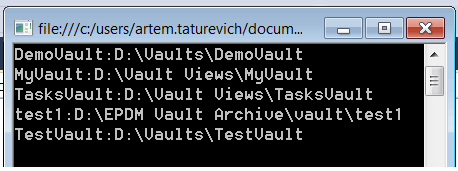

{ width=250 }

本示例演示了如何列出所有可用的保险库视图及其路径，并将信息打印到控制台窗口。

使用[IEdmVault8::GetVaultViews](https://help.solidworks.com/2018/english/api/epdmapi/epdm.interop.epdm~epdm.interop.epdm.iedmvault8~getvaultviews.html) SOLIDWORKS PDM API来列出所有可用的PDM保险库的信息。此外，也可以从注册表中获取这些信息。

