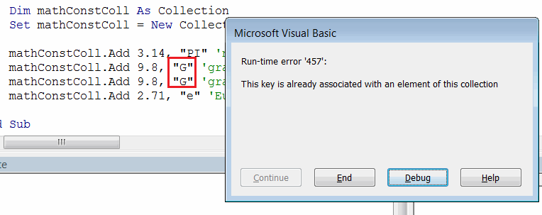

Visual Basic集合是一种类似于[数组](visual-basic/data-sets/array)的数据集，用于存储动态变化的数据。与数组不同，集合不需要调整大小来添加或删除值。

集合是一种引用类型，需要使用**new**关键字来初始化集合。

~~~ vb
Dim coll As New Collection
~~~

### 添加项目

要在Visual Basic中向集合添加新项目，需要使用**Collection**对象的**Add**方法。该方法有4个参数：

* *item* - 要添加到集合中的元素。元素可以是任何类型。
* *(可选)key* - 与元素关联的字符串键值。[参考](#indexing-items-by-keys)
* *(可选)before* - 要在此元素之前插入此元素的集合中的基于1的索引。[参考](#inserting-item-at-position)
* *(可选)after* - 要在此元素之后插入此元素的集合中的基于1的索引。[参考](#inserting-item-at-position)

#### 添加项目

~~~ vb
Dim coll As New Collection
coll.Add "New Value"
~~~

调用**Collection**对象的**Add**方法将在集合的末尾推送元素，即新元素将被插入为最后一个元素。

#### 在指定位置插入项目

调用**Collection**对象的**Add**方法，并在第3个或第4个参数中指定整数值，将在指定位置插入元素。

~~~ vb
Dim coll As New Collection
coll.Add "A",,<在此索引之前插入元素>
coll.Add "B",,,<在此索引之后插入元素>
~~~

#### 访问项目

与数组类似，可以通过索引访问集合中的元素。

> 与数组的默认行为不同，集合的元素是基于1的索引，即第一个元素的索引为1。

可以使用()符号直接从变量或通过**Item**方法访问元素。

~~~ vb
Debug.Print coll.Item(<元素的索引>)
Debug.Print coll(<元素的索引>)
~~~



### 使用键索引项目

插入到集合中的元素可以与唯一的字符串键关联。

~~~ vb
Dim coll As New Collection
coll.Add "A", "key1"
coll.Add "B", "key2"
~~~

与元素不同，键在集合中必须是唯一的，否则将显示错误。

{ width=350 }

可以通过键访问集合中的元素（类似于通过索引访问的方式）。

~~~ vb
Debug.Print coll.Item("<键名称>")
~~~



### 删除项目

可以使用**Remove**方法动态从集合中删除项目。可以使用索引或键来指定要删除的项目。

~~~ vb
coll.Remove(<元素的索引>)
coll.Remove("<元素的键>")
~~~

