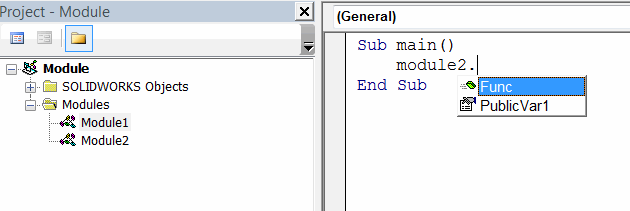

模块是用于在Visual Basic中定义自定义函数、过程或变量以组织代码的容器。

包含入口点子程序（main）的模块是入口模块。在Visual Basic宏中，至少有一个模块被定义。

要添加新模块，需要右键单击“模块”文件夹，然后选择“插入->模块”命令。

{ width=250 }

模块必须有一个由开发人员定义的唯一名称。

在模块中定义的函数是公共的。使用**Dim**关键字声明的成员（变量）仅在该模块范围内可见，对于其他模块不可见，而使用**Public**关键字声明的成员对于该模块和其他模块可见。有关更多信息，请参阅[变量作用域](visual-basic/variables/scope)文章。

在键入模块名称后，模块成员在智能感知中可用，后面跟着一个点号。

