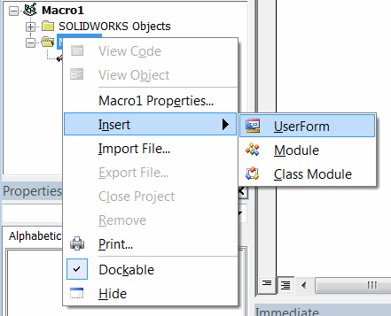
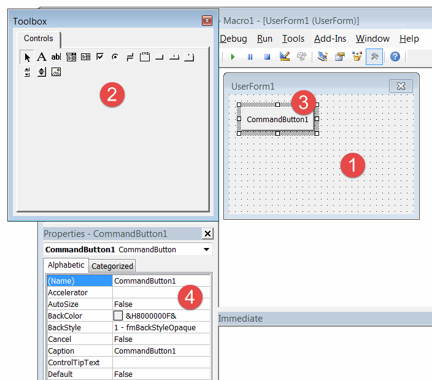
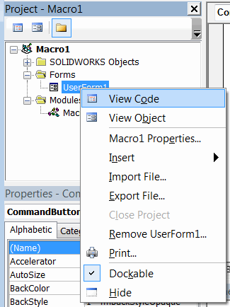
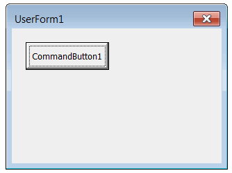

用户表单允许定义自定义的图形用户界面（GUI），以收集用户输入、显示输出或与应用程序进行交互。

可以通过调用“插入用户表单”命令来添加用户表单。

{ width=350 }

默认情况下，表单的名称将为“UserForm1”、“UserForm2”等，但建议为表单指定有意义的名称。

## 添加控件

可以自定义表单并将其他控件放置在表单上。

{ width=450 }

1. 用户表单设计布局
2. 工具箱中的控件
3. 放置在表单布局上的控件
4. 控件的属性

可以自定义控件的属性。

## 代码后台

表单及其控件会公开不同的[事件](/visual-basic/events/)，例如点击、选择、鼠标移动等。

事件处理程序在表单的代码后台中定义。

{ width=400 }

可以从下拉列表中选择可用的控件事件。

{ width=600 }

~~~vb
Private Sub CommandButton1_Click()
    MsgBox "CommandButton1 被点击了！"
End Sub
~~~

## 显示表单

可以通过调用“Show”方法来显示表单。此方法应在等于表单名称的变量上调用。请注意，不需要显式声明或实例化表单变量（与类不同）。当表单添加到项目中时，这将自动完成。

表单可以以两种模式显示

### 模态

在此模式下，表单在前台打开，父窗口在表单关闭之前不可访问。

~~~vb
Sub main()

    UserForm1.Show

End Sub
~~~

### 非模态

以一种父窗口可访问且不被阻塞的方式打开表单。要以非模态模式打开表单，需要将*vbModeless*参数传递给*Show*方法。

~~~vb
Sub main()

    UserForm1.Show vbModeless

End Sub
~~~