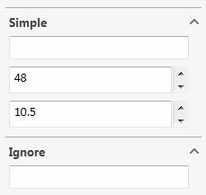

{ width=250 }

## Data model

Start by defining the data model required to be filled by property manager page.



Use properties with public getters and setters

## Events handler

Create handler for property manager page by inheriting the public class from 	
[PropertyManagerPageHandlerEx](https://docs.codestack.net/swex/pmpage/html/T_CodeStack_SwEx_PMPage_PropertyManagerPageHandlerEx.htm) class.

This class will be instantiated by the framework and will allow handling the property manager specific events from the add-in.



> Class must be com visible and have public parameterless constructor.

## Ignoring members

If it is required to exclude the members in the data model from control generation such members should be decorated with [IgnoreBindingAttribute](https://docs.codestack.net/swex/pmpage/html/T_CodeStack_SwEx_PMPage_Attributes_IgnoreBindingAttribute.htm)



## Creating instance

Create instance of the property manager page by passing the type of the handler and data model instance into the generic arguments

> Data model can contain predefined (default) values. Framework will automatically use this values in the corresponding controls.



> Store instance of the data model and the property page in the class variables. This will allow to reuse the data model in the different page instances.
