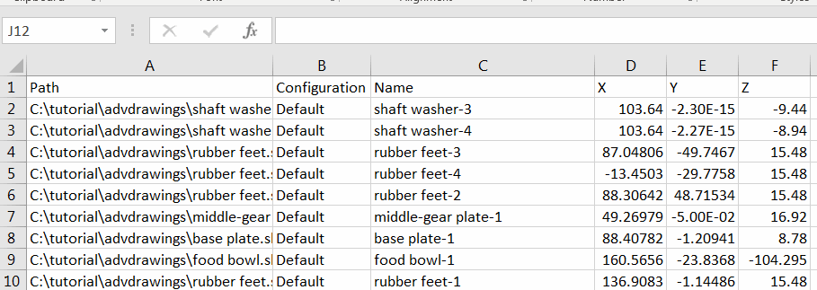

{ width=350 }

This macro exports the positions of components (X, Y, Z) from the active assembly to the comma separated values (CSV) file using SOLIDWORKS API. The file can be opened in Excel or any text editor.

The component position is a coordinate of the origin point (0, 0, 0) relative to the assembly origin.

Macro can export all components or only the instances of the selected component.

* Specify the path to output file via *OUT_FILE_PATH* constant

~~~ vb
Const OUT_FILE_PATH As String = "D:\locations.csv"
~~~

* Specify the conversion factor from meters for the coordinates

~~~ vb
Const CONV_FACTOR As Double = 1000 'meters to mm
~~~
* Optionally select the component to only export its instances (i.e. all of the components with the same file path and referenced configuration). Clear selection to export all components

As the result the CSV file is created which contains

* Component file full path
* Referenced configuration
* Component name
* X, Y, Z coordinate of the origin in the specified units


