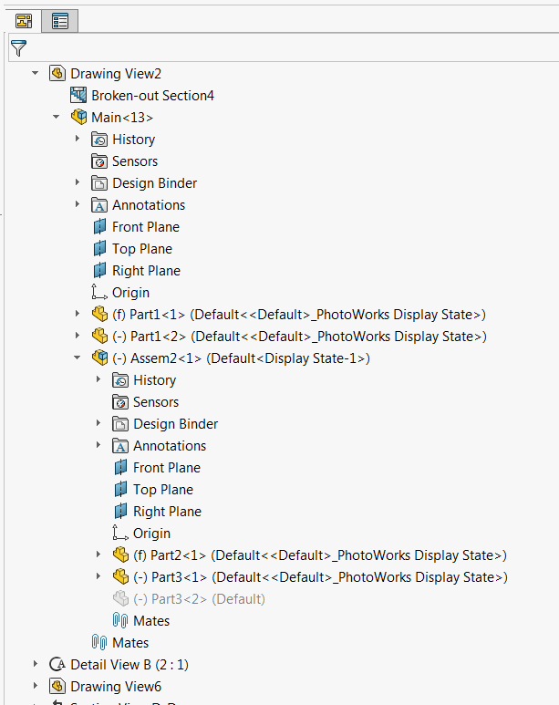

{ width=350 }

This VBA macro extracts all visible components from the selected drawing view using SOLIDWORKS API. Macro will extract all types of components (part components and assembly components).

[IView::GetVisibleComponents](https://help.solidworks.com/2013/english/api/sldworksapi/solidworks.interop.sldworks~solidworks.interop.sldworks.iview~getvisiblecomponents.html) SOLIDWORKS API methods only extracts part components (i.e. sldprt files) while all sub-assembly components are not returned. Furthermore the pointers to [IComponent2](https://help.solidworks.com/2017/english/api/sldworksapi/SOLIDWORKS.Interop.sldworks~SOLIDWORKS.Interop.sldworks.IComponent2.html) interfaces returned by this function are drawing context components. The [IComponent2::GetParent](https://help.solidworks.com/2016/english/api/sldworksapi/solidworks.interop.sldworks~solidworks.interop.sldworks.icomponent2~getparent.html) SOLIDWORKS API method returns Nothing for all components which means it is not possible to find the parent sub-assembly.

The below code addresses this limitations and returns all components in the context of their assembly document.


