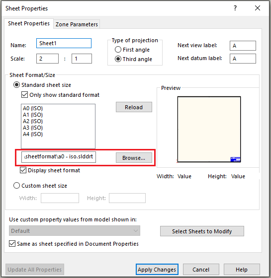

{ width=300 }

This VBA macro replaces sheet formats (*.slddrt files) in all sheets of an active drawing document according to specified mapping rules.

## Configuration

Configure the map by changing the **REPLACE_MAP** array. This array contains instructions on replacing the sheets based on the size or sheet format file of the input sheet.

This map contains an array of matching filters and resulting sheet format file in the following format:

~~~
|{Source paper size}|{Source sheet format file path}|{Target sheet format file path}
~~~

Source paper size is the constant as defined in [swDwgPaperSizes_e](https://help.solidworks.com/2016/english/api/swconst/solidworks.interop.swconst~solidworks.interop.swconst.swdwgpapersizes_e.html) enumeration. See the table below. Use one of these values or use \* to match any paper size

| Size        | Constant |
|-------------|----------|
| A           | 0        |
| A Vertical  | 1        |
| B           | 2        |
| C           | 3        |
| D           | 4        |
| E           | 5        |
| A4          | 6        |
| A4 Vertical | 7        |
| A3          | 8        |
| A2          | 9        |
| A1          | 10       |
| A0          | 11       |

Source sheet format file size is a full file path to the sheet format file or \* to match all sheet formats.

For example the below map will

* Replace all sheets with A0 size (11) regardless of the sheet format file used (\*) with the *D:\Formats\format1.slddrt* sheet format.
* Replace all sheets regardless of the size (\*) with sheet format linked to *D:\OldFormats\oldformat1.slddrt* with the *D:\Formats\format2.slddrt* file

~~~ vb
REPLACE_MAP = Array("11|*|D:\Formats\format1.slddrt", "*|D:\OldFormats\oldformat1.slddrt|D:\Formats\format2.slddrt")
~~~

You can specify as many rules as required.

Rules are executed in the specified order.

If none of the rules match the input - macro throws an error.

