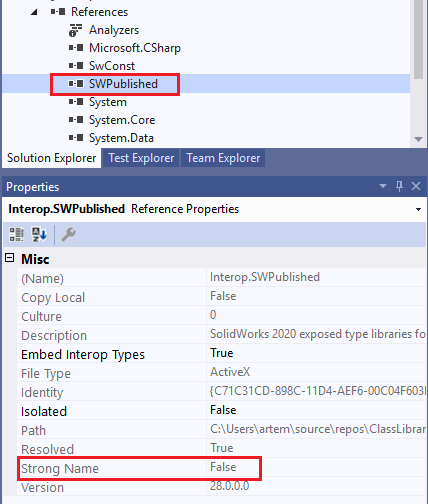

{ width=400 }

SOLIDWORKS API can be used in any COM-compatible language (i.e. C++, C#, VB.NET and Visual Basic). There are different types of applications which can be developed using the SOLIDWORKS API. Please refer the comparison table below for selecting the right type of the application which suits the requirements.

|Method|VBA Macros|Add-ins|VSTA Macros|Stand-Alones|Scripts|Comments|
|------|:--------:|:-----:|:---------:|:----------:|:-----:|--------|
|Easy to start|Yes|No|Yes|Yes|Yes|Average time spent for a not experienced user to start a solution|
|Easy To Deploy|Yes|No|No (should be easy but in practice usually a lot of problems)|Yes|Yes|Time spent to make your software work on another machines|
|Protected Code|No (only password protection)|Yes (binaries)|Yes (binaries)|Yes (binaries)|No|A ways to IP protect your code|
|Scope of available Utility Libraries|No (only obsolete VB6 libraries)|Yes|Yes|Yes|No|Availability of utility functions for working with Databases, Files, XML etc.|
|Scope of available SolidWorks functions|Limited|Full|Limited|Limited|Limited|Some interfaces will only operate within the add-in such as the ones from SWPublished library|
|Reliability|No (usually the problems with missed libraries etc)|Yes|Yes|Yes|No|How much the solution is reliable across the SoldiWorks versions and PC workstations.|
|Debugging|Easy (out of process)|Complicated (in-process). Slow to restart because requiring to restart add-in/SolidWorks|Complicated (in-process)|Easy (out of process)|No|For in-process applications it is not possible to see and change SolidWorks at runtime from UI.|
|Requirement of additional software|No|Development IDE required|No (Yes for SW 2018)|Development IDE required|No|Development IDE usually consist of code text editor and compiler (e.g Visual Studio, Eclipse, CBuilder etc.)|
|User Friendly for the beginners|Yes|No|No|No|No||
|Performance|Normal|Good|Good|Normal|Normal|Operating performance|

## References For .NET Projects

SOLIDWORKS is a COM based application so when using SOLIDWORKS API from .NET applications it is required to add the assembly interops to enable the communication with COM.

There are 2 general ways of generating the the required type libraries

### COM Type Libraries

By adding the reference to Type Library (*.tlb) files directly to the .NET project (sldworks.tlb, swconst.tlb, swpublished.tlb). This can be done either by browsing the corresponding type library file or by finding the registered reference in the COM tab. These steps are equivalent of using the [tlbimp](https://docs.microsoft.com/en-us/dotnet/framework/tools/tlbimp-exe-type-library-importer) utility as Visual Studio will convert type library to interop in the background.

As the result, the converted .NET interop equivalent is used in the project

### Primary Interop Assemblies (PIA)

By adding the interop assemblies shipped with SOLIDWORKS installation (SolidWorks.Interop.sldworks.dll, SolidWorks.Interop.swconst.dll, SolidWorks.Interop.swpublished.dll). Those types of interops are called Primary Interop Assemblies (PIA). Interop libraries are located at **SOLIDWORKS Installation Folder**\api\redist for projects targeting Framework 4.0 onwards and **SOLIDWORKS Installation Folder**\api\redist\CLR2 for projects targeting Framework 2.0 and 3.5.

For projects targeting Framework 4.0 I recommend to set the **[Embed Interop Types](https://docs.microsoft.com/en-us/dotnet/framework/interop/type-equivalence-and-embedded-interop-types)** option to *False*.
Otherwise it is possible to have unpredictable behaviour of the application when calling the SOLIDWORKS API due to a type cast issue, however this happens in rare circumstances.  

### Differences

One of the differences is different names and namespaces. For interops generated from type libraries default namespace is *SldWorks*, *SWPublished*, etc (it is possible to change the default namespace by using [tlbimp](https://docs.microsoft.com/en-us/dotnet/framework/tools/tlbimp-exe-type-library-importer) utility), while *SldWorks.Interop* prefix in namespace names is used in other case.

But there is another major difference. 

Interops, generated from COM type libraries are not [strong named](https://docs.microsoft.com/en-us/dotnet/standard/assembly/create-use-strong-named).

While interops shipped with SOLIDWORKS installation (PIA) are [strong named](https://docs.microsoft.com/en-us/dotnet/standard/assembly/create-use-strong-named).

There will be almost no difference if you are building [out-of-process stand-alone](stand-alone) applications (unless your *.exe supports plugins mechanism and can load libraries which reference SOLIDWORKS interops), but it can cause major issues for [in-process add-in](add-ins) applications if multiple add-ins refer different versions of unsigned (not strong named) interops. Similar issue is demonstrated in [this YouTube video](https://www.youtube.com/watch?v=ZeWDoJ5TC7o)

### Best Practices

* Use Primary Interop Assemblies (PIA) shipped with installation and avoid using the COM type libraries
* Do not refer the interops directly from installation folder. This would not allow compilation of the project on other computers where Interops are not placed in the same directory or not added to the GAC. In particular this would prevent implementing [Continuous Integration/Continuous Delivery (CI/CD)](https://blog.xarial.com/ci-cd/)
  * Instead place the interops onto the [NuGet Server](https://www.nuget.org/) and add this as the package. You can use either in-house hosted server or use a public one.
  * If the above option is not possible, then add the libraries in the same folder as the project (e.g. create folder *thirdpty* next to the solution *.sln file and copy interops in there) and browse the interops from this folder to add relative path references.

