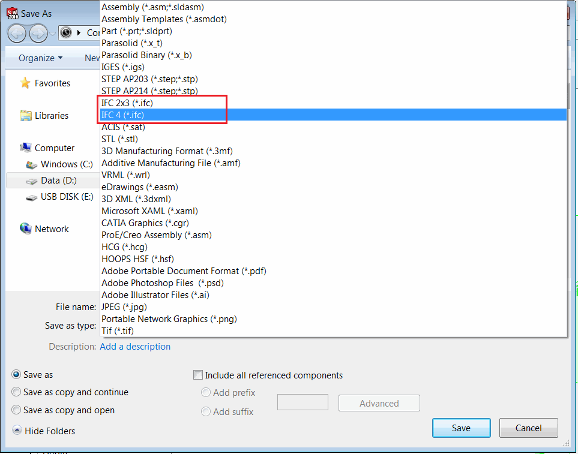
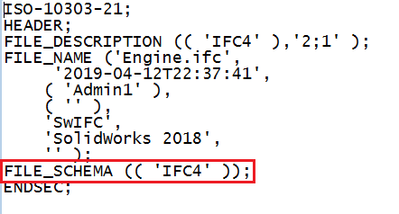

This example demonstrates how to export active assembly or part document into IFC format using SOLIDWORKS API.

{ width=450 }

Currently SOLIDWORKS supports 2 schemas for IFC format

* IFC 2x3
* IFC 4

The schema can be validated in the output IFC file when opened in text editor.

{ width=450 }

This VBA macro demonstrates how to export file to both IFC schemas. Change the value of the *IfcFormat_e* enumeration to change the format:

~~~ vb
ExportIfc swModel, OUT_FILE_PATH, IfcFormat_e.Ifc4 'Export to IFC 4
ExportIfc swModel, OUT_FILE_PATH, IfcFormat_e.Ifc2x3 'Export to IFC 2x3
~~~

Change the value of *OUT_FILE_PATH* constant to specify the output file location

~~~ vb
Const OUT_FILE_PATH As String = "C:\Output\Building.ifc"
~~~


