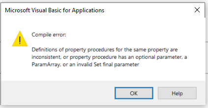

Properties have a very similar use to [variables](/visual-basic/variables/declaration/) when it comes to consuming of the property

~~~ vb jagged
Set myObj = Property1 'assigning the reference value from the property to the variable
myInt = Property2 ' assigning integer value from the property to variable
Property3 = 0.1 'assigning double value to a property
Set Property4 = CreateObject("ComClass") ' assigning the instance of COM class to property
~~~

The above code would look exactly the same if Property1, Property2, Property3 and Property4 were declared as variables and will have no difference in usage. The will also have the same intellisense icon

However properties declarations are more similar to [functions](/visual-basic/functions/).

## Types Of Properties

There are 3 types of properties:

### Read-Only Properties

Those properties can only return values. These properties act like functions:



Attempt to assign the value to read-only property results in the *invalid qualifier* compile error

### Write-Only Properties

The contrast to read-only properties are write-only properties which can be used to assign the value. These properties act like sub procedures.



There are *Let* and *Set* write properties. *Let* should be used to for simple types, such as *String*, *Integer*, *Double*, while *Set* properties should be used for reference types, such as *Object* or instances custom classes.

> Note, it is still possible to use Let properties for reference types, in this case Set keyword is not required to assign the value to the property. This however is not recommended practice as this would make code less readable and misaligned with functions and variables where Set keyword always used with reference types.

### Read-Write Properties

Read-write properties is a combination of read and write capabilities within a single property.



Declaration of read and write properties must have the same name and have the same type, i.e. type of the parameter in the write property must match the type of the return value in read property, otherwise the *Definitions of property procedures for the same property are inconsistent, or property procedure has an optional parameter, a ParamArray or invalid Set final parameter* compile time error will be thrown



Note that when type is not explicitly declared for the property it would be treated as Variant.

## Properties With Parameters

Although this is rarely used, properties can have additional parameters.



> If you need more than 1 parameter in the property, consider using function instead.

## Usage

Although properties can be considered redundant as all the functionality covered by properties can be achieved by functions, properties provide better code readability and easier consumption of class or module. Prefer to use properties for the elements which describe the property of the entity rather than action, for example for the class *Car*, it would be beneficial to declare *Color*, *Made*, *YearOfManufacturing* as properties (instead of *GetColor*, *SetColor*, *GetMade* etc. functions), while *Drive* would be declared as procedure.