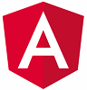

[Angular](https://angular.io/)是由Google开发的开源Web框架。它拥有创建丰富的跨平台Web（Web、移动、移动本地、桌面本地）应用程序所需的一切。

该框架支持面向对象编程原则，并且是基于组件的。

这些组件是使用MVC模式构建的。Angular使用TypeScript。

下面是一个展示Angular组件的图片：

* 视图是一个包含HTML和CSS文件的UI组件
* 控制器是一个中介组件，将视图连接到模型
* 模型是一个服务组件，实现Web应用程序的业务逻辑，通常包含Web API调用、数据库连接等。

您可以将组件制作成模块，因为组件是可重用的。模块将使代码易于理解、维护，并适合单元测试。

使用Angular构建的网站示例：

* [Forbes](https://www.forbes.com)
* [Microsoft Customers](https://customers.microsoft.com/en-us)
* [Google Express](https://express.google.com/)
* [Microsoft Office Home](https://www.office.com/apps?auth=2)
* [Delta](https://www.delta.com/)
* 还有许多其他网站...