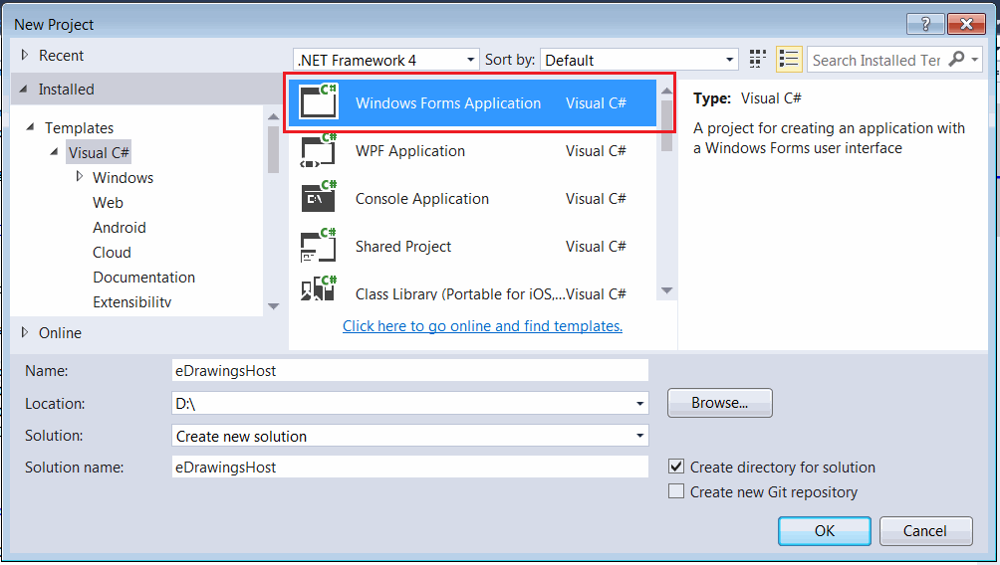

本教程是一个逐步指南，教你如何使用C#在Windows Forms中托管eDrawings控件。

## 创建新的Windows Forms项目

* 打开Visual Studio
* 创建新项目，在*Visual C#*模板部分选择*Windows Forms应用程序*

{ width=550 }

## 添加eDrawings互操作

需要添加eDrawings控件的互操作。请注意，互操作只包含方法和类的签名（不包含实现）。要使用eDrawings的API，仍然需要安装eDrawings。但是，不需要安装SOLIDWORKS应用程序。

通过在eDrawings的安装文件夹中搜索*eDrawings.Interop.EModelViewControl.dll*文件来定位eDrawings互操作库。通常路径为*C:\Program Files\Common Files\eDrawings[版本]\eDrawings.Interop.EModelViewControl.dll*

我建议禁用嵌入互操作以避免潜在的类型转换错误：

{ width=350 }

## 创建eDrawings控件包装器

默认情况下，eDrawings API不提供在Windows Forms上托管的.NET控件。因此，需要通过实现[AxHost](https://docs.microsoft.com/zh-cn/dotnet/api/system.windows.forms.axhost)控件并在构造函数中提供eDrawings GUID来创建相应的包装器。在下面的实现中，使用了与版本无关的（*22945A69-1191-4DCF-9E6F-409BDE94D101*）GUID，这意味着您的应用程序向后兼容，并且可以与更新的eDrawings版本一起使用。如果需要，可以在注册表中找到eDrawing控件的特定版本GUID。

### eDrawingHost.cs

~~~ cs
using eDrawings.Interop.EModelViewControl;
using System;
using System.Windows.Forms;

namespace CodeStack.Examples.eDrawings
{
    public class eDrawingHost : AxHost
    {
        public event Action<EModelViewControl> ControlLoaded;

        private bool m_IsLoaded;

        public eDrawingHost() : base("22945A69-1191-4DCF-9E6F-409BDE94D101")
        {
            m_IsLoaded = false;
        }

        protected override void OnCreateControl()
        {
            base.OnCreateControl();

            if (!m_IsLoaded)
            {
                m_IsLoaded = true;
                var ctrl = this.GetOcx() as EModelViewControl;
                ControlLoaded?.Invoke(this.GetOcx() as EModelViewControl);
            }
        }
    }
}

~~~

> eDrawings控件不会立即加载，直接在构造函数之后调用[AxHost::GetOcx](https://docs.microsoft.com/zh-cn/dotnet/api/system.windows.forms.axhost.getocx)将导致空引用。在控件完全加载之前调用此方法可能会导致死锁。

## 将控件添加到Windows Form

在项目中添加一个新的窗体，并将其命名为*MainForm*。

解决方案树将类似于下面的样子：

{ width=350 }

将以下代码添加到窗体的代码后面。将SOLIDWORKS文件的路径设置为*FILE_PATH*常量。该代码将等待eDrawings控件完全加载，并自动打开指定的文件。

{ width=350 }

### MainForm.cs

~~~ cs
using eDrawings.Interop.EModelViewControl;
using System;
using System.Diagnostics;
using System.Windows.Forms;

namespace CodeStack.Examples.eDrawings
{
    public partial class MainForm : Form
    {
        private const string FILE_PATH = @"D:\Box.sldprt";

        public MainForm()
        {
            InitializeComponent();

            var host = new eDrawingHost();
            host.ControlLoaded += OnControlLoaded;
            this.Controls.Add(host);
            host.Dock = DockStyle.Fill;
        }

        private void OnControlLoaded(EModelViewControl ctrl)
        {
            ctrl.OnFinishedLoadingDocument += OnFinishedLoadingDocument;
            ctrl.OnFailedLoadingDocument += OnFailedLoadingDocument;
            ctrl.OpenDoc(FILE_PATH, false, false, false, "");
        }

        private void OnFailedLoadingDocument(string fileName, int errorCode, string errorString)
        {
            Trace.WriteLine($"{fileName} failed to loaded: {errorString}");
        }

        private void OnFinishedLoadingDocument(string fileName)
        {
            Trace.WriteLine($"{fileName} loaded");
        }
    }
}

~~~

源代码可在[GitHub](https://github.com/codestackdev/solidworks-api-examples/tree/master/edrawings-api/eDrawingsWinFormsHost)上找到。