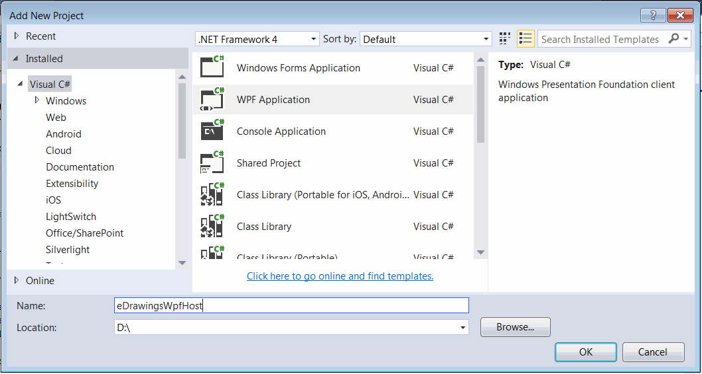
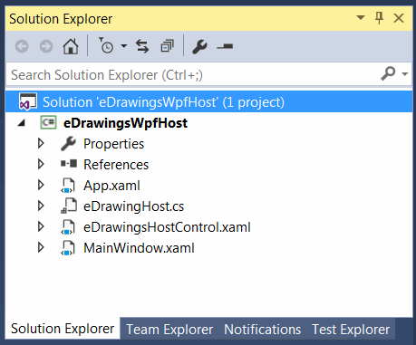

eDrawings API没有提供用于WPF的原生控件。但是可以使用[WindowsFormsIntegration](https://docs.microsoft.com/zh-cn/dotnet/api/system.windows.forms.integration)框架在Windows Presentation Foundation (WPF)环境中托管Windows Forms控件。请按照[在Windows Forms中托管eDrawings控件](/edrawings-api/gettings-started/winforms/)指南创建用于Windows Forms的eDrawings控件。

## 创建新项目

* 启动Visual Studio
* 创建新项目，在*Visual C#*模板部分选择*WPF应用程序*
{ width=550 }
* 按照[在Windows Forms中托管eDrawings控件](/edrawings-api/gettings-started/winforms/)指南的步骤添加eDrawings互操作
* 添加对*WindowsFormsIntegration*的引用

## 创建eDrawings WPF控件

为eDrawings主机Windows Forms控件创建一个包装器

### eDrawingHost.cs

~~~ cs
using eDrawings.Interop.EModelViewControl;
using System;
using System.Windows.Forms;

namespace CodeStack.Examples.eDrawings
{
    public class eDrawingHost : AxHost
    {
        public event Action<EModelViewControl> ControlLoaded;

        private bool m_IsLoaded;

        public eDrawingHost() : base("22945A69-1191-4DCF-9E6F-409BDE94D101")
        {
            m_IsLoaded = false;
        }

        protected override void OnCreateControl()
        {
            base.OnCreateControl();

            if (!m_IsLoaded)
            {
                m_IsLoaded = true;
                var ctrl = this.GetOcx() as EModelViewControl;
                ControlLoaded?.Invoke(this.GetOcx() as EModelViewControl);
            }
        }
    }
}

~~~

创建新的WPF用户控件，用于托管eDrawings，并可放置在其他WPF控件或WPF窗口上

解决方案树将类似于下面的结构。

{ width=350 }

### eDrawingsHostControl.xaml

XAML中不会有任何逻辑或额外的标记，所有内容都将在代码后台中实现

~~~ xaml
<UserControl x:Class="CodeStack.Examples.eDrawings.eDrawingsHostControl"
             xmlns="http://schemas.microsoft.com/winfx/2006/xaml/presentation"
             xmlns:x="http://schemas.microsoft.com/winfx/2006/xaml"
             xmlns:mc="http://schemas.openxmlformats.org/markup-compatibility/2006" 
             xmlns:d="http://schemas.microsoft.com/expression/blend/2008" 
             xmlns:local="clr-namespace:CodeStack.Examples.eDrawings"
             mc:Ignorable="d" 
             d:DesignHeight="300" d:DesignWidth="300">
</UserControl>

~~~

### eDrawingsHostControl.xaml.cs

~~~ cs
using eDrawings.Interop.EModelViewControl;
using System;
using System.Diagnostics;
using System.IO;
using System.Windows;
using System.Windows.Controls;
using System.Windows.Forms.Integration;

namespace CodeStack.Examples.eDrawings
{
    public partial class eDrawingsHostControl : UserControl
    {
        private EModelViewControl m_Ctrl;

        public eDrawingsHostControl()
        {
            InitializeComponent();

            var host = new WindowsFormsHost();
            var ctrl = new eDrawingHost();
            ctrl.ControlLoaded += OnControlLoaded;
            host.Child = ctrl;
            this.AddChild(host);
        }
        
        public string FilePath
        {
            get { return (string)GetValue(FilePathProperty); }
            set { SetValue(FilePathProperty, value); }
        }

        public static readonly DependencyProperty FilePathProperty =
            DependencyProperty.Register(nameof(FilePath), typeof(string),
                typeof(eDrawingsHostControl), new FrameworkPropertyMetadata(OnFilePathPropertyChanged));

        private static void OnFilePathPropertyChanged(DependencyObject d, DependencyPropertyChangedEventArgs e)
        {
            (d as eDrawingsHostControl).OpenFile(e.NewValue as string);
        }

        private void OpenFile(string filePath)
        {
            if (m_Ctrl == null)
            {
                throw new NullReferenceException("eDrawings control is not loaded");
            }

            if (string.IsNullOrEmpty(filePath) || !File.Exists(filePath))
            {
                m_Ctrl.CloseActiveDoc("");
            }
            else
            {
                m_Ctrl.OpenDoc(filePath, false, false, false, "");
            }
        }

        private void OnControlLoaded(EModelViewControl ctrl)
        {
            m_Ctrl = ctrl;
            m_Ctrl.OnFinishedLoadingDocument += OnFinishedLoadingDocument;
            m_Ctrl.OnFailedLoadingDocument += OnFailedLoadingDocument;
        }

        private void OnFailedLoadingDocument(string fileName, int errorCode, string errorString)
        {
            Trace.WriteLine($"{fileName} failed to loaded: {errorString}");
        }

        private void OnFinishedLoadingDocument(string fileName)
        {
            Trace.WriteLine($"{fileName} loaded");
        }
    }
}

~~~

在此示例中，该控件定义了依赖属性*FilePath*，可以进行绑定，并表示要在eDrawings中打开的SOLIDWORKS文件的路径

### MainWindow.xaml

将以下标记添加到MainWindow中。它定义了文本框控件，其*Text*属性绑定到WPF eDrawing控件的*FilePath*依赖属性。这意味着一旦文本框中的值更改，文件将立即加载。

~~~ xaml
<Window x:Class="CodeStack.Examples.eDrawings.MainWindow"
        xmlns="http://schemas.microsoft.com/winfx/2006/xaml/presentation"
        xmlns:x="http://schemas.microsoft.com/winfx/2006/xaml"
        xmlns:d="http://schemas.microsoft.com/expression/blend/2008"
        xmlns:mc="http://schemas.openxmlformats.org/markup-compatibility/2006"
        xmlns:local="clr-namespace:CodeStack.Examples.eDrawings"
        mc:Ignorable="d"
        Title="MainWindow" Height="350" Width="525">
	<Grid>
		<Grid.RowDefinitions>
			<RowDefinition Height="*"/>
			<RowDefinition Height="Auto"/>
		</Grid.RowDefinitions>
		<local:eDrawingsHostControl Grid.Row="0" FilePath="{Binding Path=Text, ElementName=txtFilePath, UpdateSourceTrigger=Explicit}"/>
		<TextBox Grid.Row="1" x:Name="txtFilePath"/>
	</Grid>
</Window>

~~~

更改文本框中的文件路径，以查看文件加载到WPF窗体中。

{ width=350 }

源代码可在[GitHub](https://github.com/codestackdev/solidworks-api-examples/tree/master/edrawings-api/eDrawingsWpfHost)上找到。