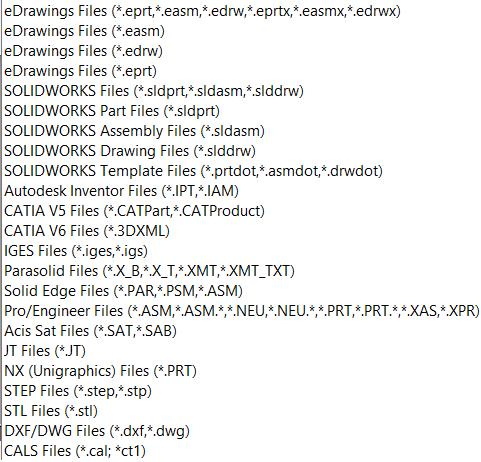

这个使用C#开发的控制台应用程序可以使用SOLIDWORKS eDrawings的免费版本通过其API将SOLIDWORKS、DXF、DWG和eDrawings文件导出为外部格式（.jpg、.tif、.bmp、.stl、.exe、.htm、.zip、.edrw、.eprt和.easm）。使用此工具不需要安装SOLIDWORKS或使用其许可证。

此功能已集成到[xPort](https://cadplus.xarial.com/xport/)实用程序中。

## 运行工具

可以从命令行运行此应用程序，并使用以下参数：

* **-input** 输入目录或文件路径列表以进行处理。这些文件可以被eDrawings打开（例如SOLIDWORKS文件、CATIA、STEP、DXF/DWG等）。请参阅下面的完整列表：

{ width=250 }

* **-filter** 用于提取输入文件的过滤器，如果**-input**参数包含目录
* **-outdir** 导出结果的目录路径。如果该参数未指定，则文件将被导出到与输入文件相同的文件夹中，工具将自动创建目录（如果不存在）。
* **-format** 导出文件的格式列表。支持的格式：.jpg、.tif、.bmp、.png、.stl、.exe、.htm、.zip、.edrw、.eprt和.easm。指定.e以导出到eDrawings的相应格式（例如.sldprt导出为.eprt，.sldasm导出为.easm，.slddrw导出为.edrw）。如果未指定此参数，则文件将被导出到eDrawings。

工具应以以下格式调用：

~~~
[参数名称] 参数值1，参数值2 ... 参数值N
~~~

请参阅下面的参数示例

## 示例命令

* 从驱动器C中的*SW Drawings*和*SW Models*文件夹（包括子文件夹）中导出所有SOLIDWORKS文件（与过滤器*.sld*匹配，即扩展名以.sld开头）到*eDrawings*格式（.eprt用于零件，.easm用于装配，.edrw用于图纸）和html格式的*C:\EDRW*文件夹。

~~~
> export.exe -input "C:\SW Drawings" "C:\SW Models" -output C:\EDRW -filter *.sld* -format .e .html
~~~

* 将*C:\Models\Part.sldprt*导出为*C:\Models\Part.eprt*

~~~
> export.exe -input "C:\Models\Part.sldprt"
~~~

* 将*C:\Models*文件夹中的所有文件导出为可执行的eDrawings格式。每个文件将保存在与原始输入文件相同的文件夹中。

~~~
> export.exe -input C:\Models -format .exe
~~~

## 结果

操作进度将显示在控制台窗口中

根据设置创建输出文件。

## EDrawingsHost.cs

~~~ cs
using System;
using System.Windows.Forms;
using eDrawings.Interop.EModelViewControl;

namespace Export
{
    public class EDrawingsHost : AxHost
    {
        public event Action<EModelViewControl> ControlLoaded;
        private bool m_IsLoaded;

        public EDrawingsHost() : base("22945A69-1191-4DCF-9E6F-409BDE94D101")
        {
            m_IsLoaded = false;
        }

        protected override void OnCreateControl()
        {
            base.OnCreateControl();

            if (!m_IsLoaded)
            {
                m_IsLoaded = true;
                var ctrl = GetOcx() as EModelViewControl;
                ControlLoaded?.Invoke(GetOcx() as EModelViewControl);
            }
        }
    }
}

~~~

## Program.cs

~~~ cs
using eDrawings.Interop.EModelViewControl;
using System;
using System.Collections.Generic;
using System.IO;
using System.Linq;
using System.Windows.Forms;

namespace Export
{
    class Program
    {
        private class ExportData
        {
            public string InputFilePath { get; private set; }
            public string OutputFilePath { get; private set; }

            public ExportData(string input, string output)
            {
                InputFilePath = input;
                OutputFilePath = output;
            }
        }

        private const string ARG_INPUT = "-input";
        private const string ARG_FILTER = "-filter";
        private const string ARG_OUTPUT_DIR = "-outdir";
        private const string ARG_FORMAT = "-format";

        private const string EDRW_FORMAT = ".e";

        private static EModelViewControl m_Ctrl;

        private static List<ExportData> m_Job;

        private static ExportData m_CurrentExport;

        [STAThread]
        static void Main(string[] args)
        {
            try
            {
                ParseArguments(args);

                var eDrwCtrl = new EDrawingsHost();

                eDrwCtrl.ControlLoaded += OnEdrawingsControlLoaded;

                var winForm = new Form();
                winForm.Controls.Add(eDrwCtrl);
                eDrwCtrl.Dock = DockStyle.Fill;
                winForm.ShowIcon = false;
                winForm.ShowInTaskbar = false;
                winForm.WindowState = FormWindowState.Minimized;
                winForm.ShowDialog();
            }
            catch (Exception ex)
            {
                PrintError(ex.Message);
            }
        }

        private static void ParseArguments(string[] args)
        {
            var inputs = new List<string>();
            var filters = new List<string>();
            var outDirs = new List<string>();
            var formats = new List<string>();

            List<string> curList = null;

            for (int i = 0; i < args.Length; i++)
            {
                if (args[i].Equals(ARG_INPUT, StringComparison.CurrentCultureIgnoreCase))
                {
                    curList = inputs;
                }
                else if (args[i].Equals(ARG_FILTER, StringComparison.CurrentCultureIgnoreCase))
                {
                    curList = filters;
                }
                else if (args[i].Equals(ARG_OUTPUT_DIR, StringComparison.CurrentCultureIgnoreCase))
                {
                    curList = outDirs;
                }
                else if (args[i].Equals(ARG_FORMAT, StringComparison.CurrentCultureIgnoreCase))
                {
                    curList = formats;
                }
                else
                {
                    if (curList != null)
                    {
                        curList.Add(args[i]);
                    }
                    else
                    {
                        throw new ArgumentException("Arguments are invalid, specify the correct switch");
                    }
                }
            }
            
            foreach (var outDir in outDirs)
            {
                if (!Directory.Exists(outDir))
                {
                    Directory.CreateDirectory(outDir);
                }
            }

            if (!outDirs.Any())
            {
                outDirs.Add("");
            }

            if (!inputs.Any())
            {
                throw new ArgumentException($"Inputs are not specified. Use {ARG_INPUT} switch to specify the input directory(s) or file(s)");
            }

            if (!formats.Any())
            {
                formats.Add(EDRW_FORMAT);
            }

            var filter = filters.Any() ? filters.First() : "*.*";

            var files = new List<string>();

            foreach (var input in inputs)
            {
                if (Directory.Exists(input))
                {
                    files.AddRange(Directory.GetFiles(input, filter, SearchOption.AllDirectories).ToList());
                }
                else if (File.Exists(input))
                {
                    files.Add(input);
                }
                else
                {
                    throw new Exception("Specify input file or directory");
                }
            }

            m_Job = new List<ExportData>();

            foreach (var file in files)
            {
                foreach (var outDir in outDirs)
                {
                    foreach (var format in formats)
                    {
                        var ext = format;

                        if (!ext.StartsWith("."))
                        {
                            ext = "." + ext;
                        }

                        if (ext.Equals(EDRW_FORMAT, StringComparison.CurrentCultureIgnoreCase))
                        {
                            switch (Path.GetExtension(file).ToLower())
                            {
                                case ".sldprt":
                                    ext = ".eprt";
                                    break;
                                case ".sldasm":
                                    ext = ".easm";
                                    break;
                                case ".slddrw":
                                    ext = ".edrw";
                                    break;
                                default:
                                    throw new ArgumentException($"{EDRW_FORMAT} format is only applicable for SOLIDWORKS files");
                            }
                        }

                        var outFile = Path.Combine(!string.IsNullOrEmpty(outDir) ? outDir : Path.GetDirectoryName(file),
                            Path.GetFileNameWithoutExtension(file) + ext);

                        m_Job.Add(new ExportData(file, outFile));
                    }
                }
            }
        }

        public static void OnEdrawingsControlLoaded(EModelViewControl ctrl)
        {
            Console.WriteLine(string.Format("Starting job. Exporting {0} file(s)", m_Job.Count));

            m_Ctrl = ctrl;

            m_Ctrl.OnFinishedLoadingDocument += OnDocumentLoaded;
            m_Ctrl.OnFailedLoadingDocument += OnDocumentLoadFailed;
            m_Ctrl.OnFinishedSavingDocument += OnDocumentSaved;
            m_Ctrl.OnFailedSavingDocument += OnSaveFailed;

            ExportNext();
        }

        public static void ExportNext()
        {
            m_CurrentExport = null;

            if (m_Job.Any())
            {
                m_CurrentExport = m_Job.First();
                m_Job.RemoveAt(0);

                if (!string.Equals(m_Ctrl.FileName, m_CurrentExport.InputFilePath, StringComparison.CurrentCultureIgnoreCase))
                {
                    m_Ctrl.CloseActiveDoc("");
                    m_Ctrl.OpenDoc(m_CurrentExport.InputFilePath, false, false, false, "");
                }
                else
                {
                    ExportCurrentFile();
                }
            }
            else
            {
                Console.WriteLine("Completed");
                Environment.Exit(0);
            }
        }

        public static void OnDocumentLoaded(string fileName)
        {
            Console.WriteLine(string.Format("Opened {0}", fileName));
            ExportCurrentFile();
        }

        private static void ExportCurrentFile()
        {
            Console.WriteLine($"Exporting {m_CurrentExport.InputFilePath} to {m_CurrentExport.OutputFilePath}");
            m_Ctrl.Save(m_CurrentExport.OutputFilePath, false, "");
        }

        public static void OnDocumentLoadFailed(string fileName, int errorCode, string errorString)
        {
            PrintError(string.Format("Failed to load {0}: {1}", fileName, errorString));
            ExportNext();
        }

        private static void OnDocumentSaved()
        {
            Console.WriteLine("Export completed");
            ExportNext();
        }

        private static void OnSaveFailed(string FileName, int ErrorCode, string ErrorString)
        {
            PrintError($"Failed to export 'FileName': {ErrorString} [{ErrorCode}]");
            ExportNext();
        }
        
        public static void PrintError(string msg)
        {
            Console.ForegroundColor = ConsoleColor.Red;
            Console.WriteLine(msg);
            Console.ResetColor();
        }
    }
}

~~~

源代码可在[GitHub](https://github.com/codestackdev/solidworks-api-examples/tree/master/edrawings-api/Export)上找到。