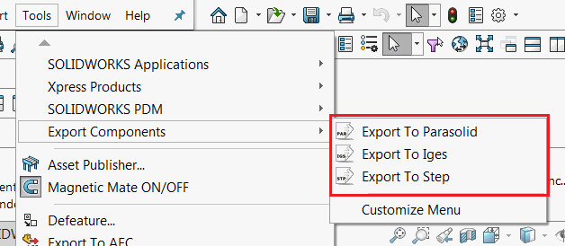
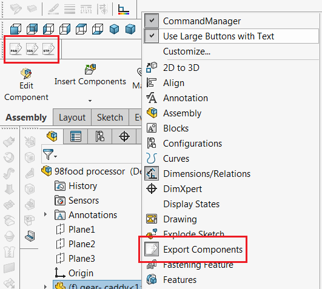
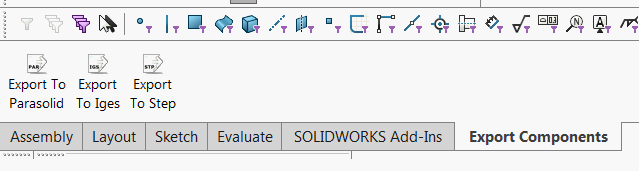
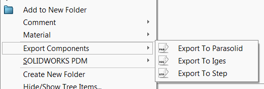

[定义的命令](/labs/solidworks/swex/add-in/commands-manager/defining-commands/)可以托管在SOLIDWORKS命令区域的不同位置：[命令组](#command-group)，其中包括[菜单](#menu)、[工具栏](#toolbar)和[命令选项卡框（功能区）](#command-tab-box)，以及[上下文菜单](#context-menu)。

## 命令组

要添加命令组，需要调用[AddCommandGroup](https://docs.codestack.net/swex/add-in/html/M_CodeStack_SwEx_AddIn_SwAddInEx_AddCommandGroup__1.htm)方法，并将枚举类型作为泛型参数传递。

需要提供带有枚举器参数的void处理程序函数，当单击命令时，框架将调用该函数。



### 菜单

{ width=350 }

默认情况下，命令将添加到菜单和[工具栏](#toolbar)。可以通过为[CommandItemInfoAttribute](https://docs.codestack.net/swex/add-in/html/T_CodeStack_SwEx_AddIn_Attributes_CommandItemInfoAttribute.htm)属性的*hasMenu*布尔参数分配值来更改此行为。

### 工具栏

{ width=350 }

默认情况下，命令将添加到[菜单](#menu)和工具栏。可以通过为[CommandItemInfoAttribute](https://docs.codestack.net/swex/add-in/html/T_CodeStack_SwEx_AddIn_Attributes_CommandItemInfoAttribute.htm)属性的*hasToolbar*布尔参数分配值来更改此行为。

### 命令选项卡框

{ width=450 }

可以通过将[CommandItemInfoAttribute](https://docs.codestack.net/swex/add-in/html/T_CodeStack_SwEx_AddIn_Attributes_CommandItemInfoAttribute.htm)的*showInCmdTabBox*参数设置为*true*来将命令项添加到选项卡框中，以便为枚举中定义的特定命令。

*textStyle*参数允许指定提示文本相对于图标的对齐方式。

{ width=250 }

* 仅图标（无文本）（swCommandTabButton_NoText）
* 图标下方的文本（swCommandTabButton_TextBelow）
* 图标右侧的文本，水平对齐（swCommandTabButton_TextHorizontal）



## 上下文菜单

{ width=250 }

要添加上下文菜单，需要调用[AddContextMenu](https://docs.codestack.net/swex/add-in/html/M_CodeStack_SwEx_AddIn_SwAddInEx_AddContextMenu__1.htm)方法，并将枚举作为模板参数传递。

需要提供带有枚举参数的void处理程序函数，当单击命令时，框架将调用该函数。

还可以选择性地指定此菜单应显示的选择类型。

