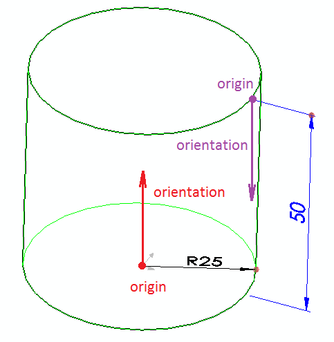

尺寸是宏特征的额外输入来源。可以通过以下方式定义尺寸：

~~~ cs
using CodeStack.SwEx.MacroFeature;
using CodeStack.SwEx.MacroFeature.Attributes;
using CodeStack.SwEx.MacroFeature.Base;
using CodeStack.SwEx.MacroFeature.Data;
using SolidWorks.Interop.sldworks;
using SolidWorks.Interop.swconst;

namespace CodeStack.SwEx
{
    public class DimensionMacroFeatureParams
    {
        [ParameterDimension(swDimensionType_e.swLinearDimension)]
        public double FirstDimension { get; set; } = 0.01;

        [ParameterDimension(swDimensionType_e.swRadialDimension)]
        public double SecondDimension { get; set; }
    }    
}

~~~

在重建后需要重新排列尺寸，可以通过重写[OnSetDimensions](https://docs.codestack.net/swex/macro-feature/html/M_CodeStack_SwEx_MacroFeature_MacroFeatureEx_1_OnSetDimensions.htm)方法来实现。使用[DimensionData::SetOrientation](https://docs.codestack.net/swex/macro-feature/html/M_CodeStack_SwEx_MacroFeature_Data_DimensionDataExtension_SetOrientation.htm)辅助方法来对齐尺寸。

~~~ cs
using CodeStack.SwEx.MacroFeature;
using CodeStack.SwEx.MacroFeature.Base;
using CodeStack.SwEx.MacroFeature.Data;
using SolidWorks.Interop.sldworks;

namespace CodeStack.SwEx
{
    public class MyDimMacroFeature : MacroFeatureEx<DimensionMacroFeatureParams>
    {
        protected override void OnSetDimensions(ISldWorks app, IModelDoc2 model,
            IFeature feature, MacroFeatureRebuildResult rebuildResult, DimensionDataCollection dims,
            DimensionMacroFeatureParams parameters)
        {
            dims[0].SetOrientation(new Point(0, 0, 0), new Vector(0, 1, 0));

            dims[1].SetOrientation(new Point(0, 0, 0), new Vector(0, 0, 1));
        }
    }
}

~~~

*Origin*是尺寸的起点。

对于线性尺寸，*orientation*表示沿尺寸方向的向量（即被测实体的方向）。
对于径向尺寸，*orientation*表示尺寸的法线（即尺寸的旋转向量）。

{ width=350 }

### 从重建中传递数据

在某些情况下，可能需要从[OnRebuild](https://docs.codestack.net/swex/macro-feature/html/M_CodeStack_SwEx_MacroFeature_MacroFeatureEx_1_OnRebuild.htm)方法中传递数据以在[OnSetDimensions](https://docs.codestack.net/swex/macro-feature/html/M_CodeStack_SwEx_MacroFeature_MacroFeatureEx_1_OnSetDimensions.htm)中使用。例如，当需要使用几何形状来计算尺寸位置时。

可以通过创建自定义重建结果并从重建函数中返回来实现这一点。

~~~ cs
using CodeStack.SwEx.MacroFeature;
using CodeStack.SwEx.MacroFeature.Base;
using CodeStack.SwEx.MacroFeature.Data;
using SolidWorks.Interop.sldworks;

namespace CodeStack.SwEx
{
    public class MyDimRegenDataMacroFeature : MacroFeatureEx<DimensionMacroFeatureParams>
    {
        public class MyData
        {
            public int Value1 { get; set; }
        }

        private class CustomRebuildResult : MacroFeatureRebuildBodyResult
        {
            internal MyData CustomData { get; private set; }

            internal CustomRebuildResult(IMacroFeatureData featData,
                IBody2[] bodies, MyData customData) : base(featData, true, bodies)
            {
                CustomData = customData;
            }
        }

        protected override MacroFeatureRebuildResult OnRebuild(ISldWorks app, IModelDoc2 model, IFeature feature, DimensionMacroFeatureParams parameters)
        {
            var featData = feature.GetDefinition() as IMacroFeatureData;

            var resBodies = GetBodies(); //generating bodies
            var customData = new MyData(); //creating custom data and assigning required values

            return new CustomRebuildResult(featData, resBodies, customData); //returning custom rebuild result
        }

        protected override void OnSetDimensions(ISldWorks app, IModelDoc2 model, IFeature feature, MacroFeatureRebuildResult rebuildResult,
            DimensionDataCollection dims, DimensionMacroFeatureParams parameters)
        {
            var rebuildRes = rebuildResult as CustomRebuildResult;

            var customData = rebuildRes.CustomData;

            //TODO: use custom data to arrange dimensions
        }

        private IBody2[] GetBodies()
        {
            //TODO: create bodies for geometry

            return null;
        }
    }
}

~~~

