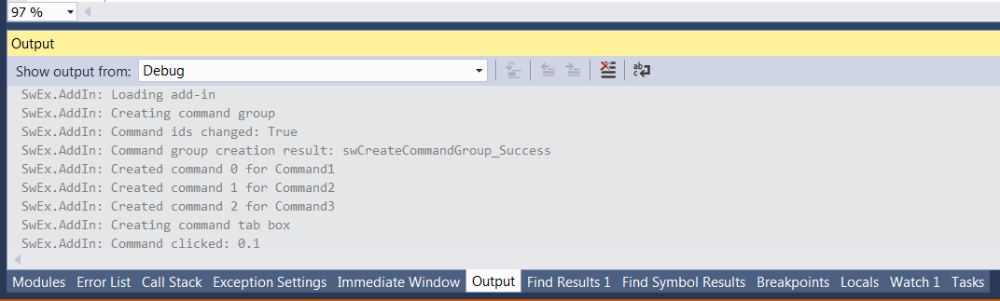
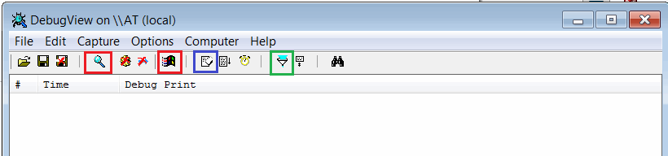
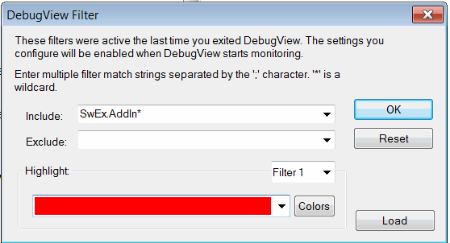
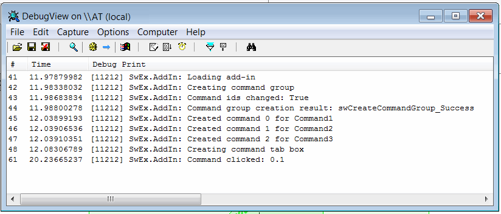

SwEx框架会输出简化故障排除过程的跟踪消息。这些消息会输出到默认的跟踪侦听器。

如果从Visual Studio调试插件，则消息会输出到Visual Studio的输出选项卡中，如下所示：

{ width=450 }

否则，可以通过微软的[DebugView](https://docs.microsoft.com/en-us/sysinternals/downloads/debugview)实用程序来跟踪消息。

* 从上面的链接下载该实用程序
* 解压缩包并运行*Dbgview.exe*
* 根据下面的标记设置设置：

从工具栏启用*Capture Win32*和*Capture Events*选项（用红色标记）

{ width=450 }

或者通过菜单设置捕获选项，如下所示：

{ width=350 }

通过单击过滤按钮（用绿色标记）设置过滤器以过滤SwEx消息

{ width=350 }

消息将输出到跟踪窗口

{ width=450 }

使用*橡皮擦*按钮清除消息（用蓝色标记）

## 注意事项
* 跟踪输出是在客户计算机上故障排除插件的强大工具
* DebugView工具是轻量级的，不需要安装，并由微软提供
* 跟踪消息也会在发布模式下输出
* 如果加载插件时抛出异常，SwEx框架将输出异常详细信息，这有助于解决无法加载插件的问题

可以从SwEx模块中记录自定义消息和异常。请参考[此链接](logging)获取更多信息。