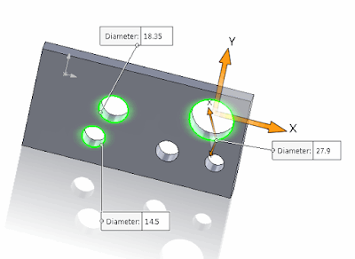
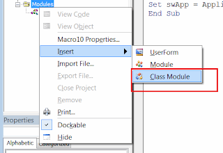

该宏将使用[SOLIDWORKS API方法ISelectionMgr::CreateCallout2](https://help.solidworks.com/2018/english/api/sldworksapi/solidworks.interop.sldworks~solidworks.interop.sldworks.iselectionmgr~createcallout2.html)来显示3D模型中所有选定圆形边缘的直径数值标注。

在检查模型时，同时查看多个直径数值非常有用。

{ width=400 height=290 }

标注是SOLIDWORKS中的一种可视元素，用于以键值对（单行或多行）的形式显示数据。标注元素在一些标准的SOLIDWORKS工具中使用，例如[测量工具](https://help.solidworks.com/2017/english/solidworks/sldworks/t_using_the_measure_tool.htm)。通常，标注会附加到选择对象上，并在取消选择对象后销毁。

运行该宏的步骤：

1. 选择圆形边缘并运行宏
2. 所有圆形边缘的直径数值标注将显示在模型的单位中
3. 清除选择以删除标注

创建新的宏并将以下代码复制到宏的模块中：

{ width=640 height=230 }

~~~ vb
Dim swApp As SldWorks.SldWorks
Dim swModel As SldWorks.ModelDoc2
Dim swSelMgr As SldWorks.SelectionMgr

Sub main()

    Set swApp = Application.SldWorks
    
    Set swModel = swApp.ActiveDoc
    
    If Not swModel Is Nothing Then
    
        Set swSelMgr = swModel.SelectionManager
        
        Dim swCalloutHandler As New HoleDiamCalloutHandler
        
        Dim i As Integer
        
        Dim swCalloutsCollection As New Collection
        
        For i = 1 To swSelMgr.GetSelectedObjectCount2(-1)
        
            If swSelMgr.GetSelectedObjectType3(i, -1) = swSelectType_e.swSelEDGES Then
            
                Dim swEdge As SldWorks.Edge
                
                Set swEdge = swSelMgr.GetSelectedObject6(i, -1)
                
                Dim swCurve As SldWorks.Curve
                
                Set swCurve = swEdge.GetCurve
                
                If swCurve.IsCircle() Then
                
                    Dim vParams As Variant
                    vParams = swCurve.CircleParams
                    
                    Dim diam As Double
                    diam = vParams(6) * 2
                    
                    Dim swUserUnit As SldWorks.UserUnit
                    Set swUserUnit = swModel.GetUserUnit(swUserUnitsType_e.swLengthUnit)
                    
                    Dim diamVal As String
                    diamVal = swUserUnit.ConvertToUserUnit(diam, False, False)
                    
                    Dim swCallout As SldWorks.Callout
                    Set swCallout = swSelMgr.CreateCallout2(1, swCalloutHandler)
                    
                    swCallout.Label2(0) = "Diameter"
                    swCallout.Value(0) = diamVal
                    
                    swSelMgr.SetCallout i, swCallout
                    
                    swCalloutsCollection.Add swCallout
                
                End If
                
            End If
            
        Next
        
        While swSelMgr.GetSelectedObjectCount2(-1) > 0
            DoEvents
        Wend
    
    Else
        MsgBox "Please open the model"
    End If
    
End Sub
~~~

创建新的类模块并将其命名为*HoleDiamCalloutHandler*。

{ width=320 height=220 }

将以下代码复制到类模块中：

~~~ vb
Implements swCalloutHandler

Private Function swCalloutHandler_OnStringValueChanged(ByVal pManipulator As Object, ByVal RowID As Long, ByVal Text As String) As Boolean

End Function

~~~

