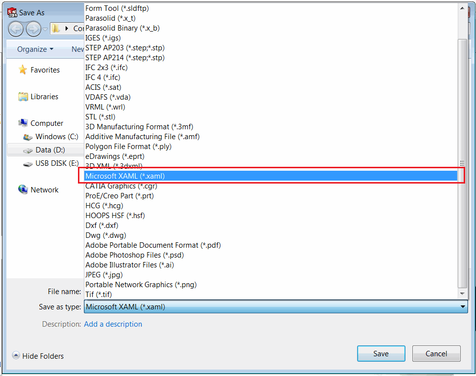

这个C#插件演示了如何使用SOLIDWORKS API将[XAML](https://en.wikipedia.org/wiki/Extensible_Application_Markup_Language)文件中的几何图形导入到活动模型空间中。为了实现最大的性能，图形使用OpenGL的[顶点缓冲对象（VBO）](https://en.wikipedia.org/wiki/Vertex_buffer_object)功能进行渲染。

使用[OpenTK](https://opentk.net/)库来调用OpenGL的API。

插件只能导入从零件文档创建的XAML文件（不支持从装配体导出的XAML文件）。

XAML文件是SOLIDWORKS原生支持的导出格式。使用“文件->另存为”菜单命令以XAML格式导出文件。

{ width=550 }

然而，这种格式不能被原生导入。插件将“导入XAML文件”命令添加到菜单中。打开新文件或现有文件，并使用此命令导入xaml。

{ width=450 }

图形使用OpenGL进行渲染。模型可以旋转、缩放、平移。没有创建特征元素或临时体，图形以高性能渲染。

{ width=350 }

默认情况下，OpenGL的图形不会受到缩放命令的影响。例如，“适应窗口大小”命令不会正确适应几何图形，并会忽略其边界框。要指定可见边界，需要使用[SOLIDWORKS API的IModelDocExtension::SetVisibleBox](https://help.solidworks.com/2017/english/api/sldworksapi/SolidWorks.Interop.sldworks~SolidWorks.Interop.sldworks.IModelDocExtension~SetVisibleBox.html)方法。注意，不需要将现有的SOLIDWORKS几何图形的可见框联合起来，SOLIDWORKS会自动执行此操作。

源代码可以从[GitHub](https://github.com/codestackdev/solidworks-api-examples/tree/master/swex/add-in/opengl/XamlImporter)下载。

## AddIn.cs

这是插件的入口点。使用[SwEx.AddIn](/labs/solidworks/swex/add-in/)框架来管理文档的生命周期，提供包装类。插件处理导入命令，并从指定的XAML文件中提取Microsoft WPF框架的[Model3DGroup](https://docs.microsoft.com/en-us/dotnet/api/system.windows.media.media3d.model3dgroup)对象。

~~~ cs
using CodeStack.SwEx.AddIn;
using CodeStack.SwEx.AddIn.Attributes;
using CodeStack.SwEx.AddIn.Base;
using CodeStack.SwEx.AddIn.Enums;
using CodeStack.SwEx.Common.Attributes;
using CodeStack.XamlImporter.Properties;
using SolidWorks.Interop.swconst;
using System;
using System.IO;
using System.Linq;
using System.Runtime.InteropServices;
using System.Windows.Controls;
using System.Windows.Forms;
using System.Windows.Markup;
using System.Windows.Media.Media3D;

namespace CodeStack.XamlImporter
{
    [Guid("1F872F6B-525E-4889-862E-B7A8C27C398C"), ComVisible(true)]
    [AutoRegister("XamlImporter")]
    public class AddIn : SwAddInEx
    {
        [Icon(typeof(Resources), nameof(Resources.xaml))]
        [Title("OpenGL Import Xaml")]
        private enum Commands_e
        {
            [Icon(typeof(Resources), nameof(Resources.xaml))]
            [Title("Import XAML File")]
            [CommandItemInfo(swWorkspaceTypes_e.Part | swWorkspaceTypes_e.Assembly)]
            ImportXamlFile
        }

        private IDocumentsHandler<MeshRendererModel> m_DocsHandler;

        public override bool OnConnect()
        {
            AddCommandGroup<Commands_e>(OnButtonClick);
            m_DocsHandler = CreateDocumentsHandler<MeshRendererModel>();
            return true;
        }

        private void OnButtonClick(Commands_e cmd)
        {
            switch (cmd)
            {
                case Commands_e.ImportXamlFile:
                    try
                    {
                        using (var openFileDlg = new OpenFileDialog())
                        {
                            openFileDlg.Filter = "Microsoft XAML Files (*.xaml)|*.xaml|All Files (*.*)|*.*";
                            openFileDlg.RestoreDirectory = true;

                            if (openFileDlg.ShowDialog() == DialogResult.OK)
                            {
                                var xamlFilePath = openFileDlg.FileName;

                                var model = GetModel3DFromFile(xamlFilePath);
                                m_DocsHandler[App.IActiveDoc2].Model3D = model;
                            }
                        }
                    }
                    catch(Exception ex)
                    {
                        App.SendMsgToUser2(ex.Message, (int)swMessageBoxIcon_e.swMbStop, (int)swMessageBoxBtn_e.swMbOk);
                    }
                    break;
            }
        }

        private Model3DGroup GetModel3DFromFile(string file)
        {
            if (File.Exists(file))
            {
                using (var fileStream = File.OpenRead(file))
                {
                    var viewPort = XamlReader.Load(fileStream) as Viewport3D;
                    var modelVisual = viewPort.Children.First() as ModelVisual3D;
                    modelVisual = modelVisual.Children.Last() as ModelVisual3D;
                    var model = modelVisual.Content as Model3DGroup;

                    if (model == null)
                    {
                        throw new InvalidCastException("Content is not Model3DGroup");
                    }

                    return model;
                }
            }
            else
            {
                throw new FileNotFoundException($"File {file} doesn't exist");
            }
        }
    }
}

~~~

## MeshRendererModel.cs

这是每个模型文档的处理程序类，订阅SOLIDWORKS提供的OpenGL缓冲区交换通知，并根据提供的网格数据进行VBO的绑定和渲染。

~~~ cs
using CodeStack.SwEx.AddIn.Base;
using System;
using System.Collections.Generic;
using System.Linq;
using SolidWorks.Interop.sldworks;
using System.Windows.Media.Media3D;
using OpenTK;
using OpenTK.Graphics.OpenGL;
using System.Windows.Media;

namespace CodeStack.XamlImporter
{
    public class MeshRendererModel : IDocumentHandler
    {
        private IMathUtility m_MathUtils;
        private IModelDoc2 m_Model;
        private ModelView m_View;

        private GLControl m_GLControl;

        private bool m_IsBufferInit;

        private int m_ColorBufferId;
        private int m_ElementBufferId;
        private int m_NormalBufferId;
        private int m_VertexBufferId;

        private int m_IndicesCount;

        private Model3DGroup m_Model3D;

        public Model3DGroup Model3D
        {
            get
            {
                return m_Model3D;
            }
            set
            {   
                m_Model3D = value;
                UpdateVisibleBox();
                m_IsBufferInit = false;
                m_Model.GraphicsRedraw2();
            }
        }

        public void Init(ISldWorks app, IModelDoc2 model)
        {
            m_MathUtils = app.IGetMathUtility();

            m_View = model.IActiveView;

            if (m_View != null)
            {
                m_View.BufferSwapNotify += OnBufferSwapNotify;
                
                m_GLControl = new GLControl();
                m_GLControl.Context.MakeCurrent(null);
            }
            else
            {
                throw new NullReferenceException("No active view");
            }

            m_Model = model;
        }

        public void Dispose()
        {
            if (m_View != null)
            {
                m_View.BufferSwapNotify += OnBufferSwapNotify;
            }

            m_GLControl.Dispose();
        }
        
        private int OnBufferSwapNotify()
        {
            if (m_Model3D != null)
            {
                if (!m_IsBufferInit)
                {
                    InitBuffer();
                    m_IsBufferInit = true;
                }

                RenderBuffer();
            }

            return 0;
        }

        private void UpdateVisibleBox()
        {
            m_Model.Extension.RemoveVisibleBox();

            if (m_Model3D != null)
            {
                var curBox = m_Model3D.Bounds;

                var pt1 = m_MathUtils.CreatePoint(new double[] { curBox.X, curBox.Y, curBox.Z }) as MathPoint;
                var pt2 = m_MathUtils.CreatePoint(new double[] { curBox.X + curBox.SizeX, curBox.Y + curBox.SizeY, curBox.Z + curBox.SizeZ }) as MathPoint;

                m_Model.Extension.SetVisibleBox(pt1, pt2);
            }
        }

        private void InitBuffer()
        {
            var posList = new List<Vector3d>();
            var indList = new List<uint>();
            var normList = new List<Vector3d>();
            var colList = new List<uint>();

            int indicesOffset = 0;

            if (m_Model3D != null)
            {
                foreach (var geometryModel in m_Model3D.Children)
                {
                    var geometryModel3d = geometryModel as GeometryModel3D;
                    if (geometryModel3d != null)
                    {
                        var color = Colors.Black;
                        var materialGrp = geometryModel3d.Material as MaterialGroup;
                        var material = materialGrp?.Children?.FirstOrDefault() as DiffuseMaterial;
                        if (material != null)
                        {
                            if (material.Brush is SolidColorBrush)
                            {
                                color = (material.Brush as SolidColorBrush).Color;
                            }
                        }

                        var geom = geometryModel3d.Geometry as MeshGeometry3D;

                        if (geom != null)
                        {
                            indList.AddRange(geom.TriangleIndices.Select(i => (uint)(i + indicesOffset)));
                            indicesOffset += geom.Positions.Count;

                            foreach (var pos in geom.Positions)
                            {
                                posList.Add(new Vector3d(pos.X, pos.Y, pos.Z));
                                colList.Add(ColorToArgb(color));
                            }

                            foreach (var norm in geom.Normals)
                            {
                                normList.Add(new Vector3d(norm.X, norm.Y, norm.Z));
                            }
                        }
                        else
                        {
                            throw new NotSupportedException("Only MeshGeometry3D is supported");
                        }
                    }
                    else
                    {
                        throw new NotSupportedException("Only GeometryModel3D is supported");
                    }
                }

                GenAndFillBuffer(posList.ToArray(), BufferTarget.ArrayBuffer, out m_VertexBufferId);
                GenAndFillBuffer(colList.ToArray(), BufferTarget.ArrayBuffer, out m_ColorBufferId);
                GenAndFillBuffer(normList.ToArray(), BufferTarget.ArrayBuffer, out m_NormalBufferId);
                GenAndFillBuffer(indList.ToArray(), BufferTarget.ElementArrayBuffer, out m_ElementBufferId);

                m_IndicesCount = indList.Count;
            }
        }

        private void RenderBuffer()
        {
            GL.Disable(EnableCap.Lighting);

            GL.BindBuffer(BufferTarget.ArrayBuffer, m_NormalBufferId);
            GL.NormalPointer(NormalPointerType.Double, Vector3d.SizeInBytes, IntPtr.Zero);
            GL.EnableClientState(ArrayCap.NormalArray);

            GL.BindBuffer(BufferTarget.ArrayBuffer, m_VertexBufferId);
            GL.VertexPointer(3, VertexPointerType.Double, Vector3d.SizeInBytes, IntPtr.Zero);
            GL.EnableClientState(ArrayCap.VertexArray);

            GL.BindBuffer(BufferTarget.ArrayBuffer, m_ColorBufferId);
            GL.ColorPointer(4, ColorPointerType.UnsignedByte, sizeof(int), IntPtr.Zero);
            GL.EnableClientState(ArrayCap.ColorArray);

            GL.BindBuffer(BufferTarget.ElementArrayBuffer, m_ElementBufferId);

            GL.DrawElements(PrimitiveType.Triangles, m_IndicesCount, DrawElementsType.UnsignedInt, IntPtr.Zero);
        }

        private uint ColorToArgb(Color color)
        {
            return (uint)color.A << 24 | (uint)color.B << 16 | (uint)color.G << 8 | (uint)color.R;
        }

        private void GenAndFillBuffer<T>(T[] dataBuffer, BufferTarget target, out int bufferId)
            where T : struct
        {
            GL.GenBuffers(1, out bufferId);
            GL.BindBuffer(target, bufferId);
            var size = dataBuffer.Length * BlittableValueType.StrideOf(dataBuffer);
            GL.BufferData(target, new IntPtr(size), dataBuffer, BufferUsageHint.StaticDraw);

            int bufferSize;

            GL.GetBufferParameter(target, BufferParameterName.BufferSize, out bufferSize);

            if (size != bufferSize)
            {
                throw new Exception("Buffer size mismatch");
            }

            GL.BindBuffer(target, 0);
        }
    }
}

~~~

