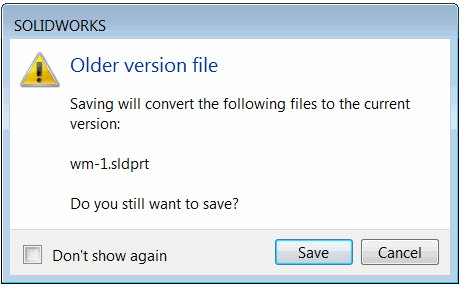

这个VBA宏允许使用SOLIDWORKS API静默保存当前打开和修改过的所有文档。与默认的另存为命令不同，在保存文件时可能会显示各种警告消息，而这个宏将在保存文档时不显示任何弹出消息。

{ width=350 }

宏可以配置为显示错误（如果某些文件未正确保存）或保持静默。

~~~ vb
Const SHOW_ERROR As Boolean = False 'True表示在出现错误时显示消息框，False表示保持静默
~~~

操作的结果将显示在状态栏中。

这个宏可以作为后台集成的一部分使用，其中不应显示模态对话框。

~~~ vb
Const SHOW_ERROR As Boolean = False

Dim swApp As SldWorks.SldWorks

Sub main()

    Set swApp = Application.SldWorks
    
    Dim swFrame As SldWorks.Frame
    Set swFrame = swApp.Frame()
    
    Dim vModelWnds As Variant
    vModelWnds = swFrame.ModelWindows
    
    If Not IsEmpty(vModelWnds) Then
        
        Dim i As Integer
        
        Dim savedCount As Integer
        Dim failedCount As Integer
        savedCount = 0
        failedCount = 0
        
        For i = 0 To UBound(vModelWnds)
            
            Dim swModelWnd As SldWorks.ModelWindow
            Set swModelWnd = vModelWnds(i)
            Dim swModel As SldWorks.ModelDoc2
            Set swModel = swModelWnd.ModelDoc
            
            If swModel.GetSaveFlag() Then
                
                Dim errs As Long
                Dim warns As Long
                
                If False = swModel.Save3(swSaveAsOptions_e.swSaveAsOptions_Silent, errs, warns) Then
                    failedCount = failedCount + 1
                    Debug.Print "Failed to save " & swModel.GetTitle() & ": " & errs
                Else
                    savedCount = savedCount + 1
                    Debug.Print "Saved " & swModel.GetTitle
                End If
                
            End If
            
        Next
        
        swFrame.SetStatusBarText "Saved " & savedCount & " document(s). Failed: " & failedCount & " document(s)"
        
        If failedCount > 0 And SHOW_ERROR Then
            swApp.SendMsgToUser2 "Some of the files failed to save automatically", swMessageBoxIcon_e.swMbWarning, swMessageBoxBtn_e.swMbOk
        End If
        
    End If
    
End Sub
~~~

