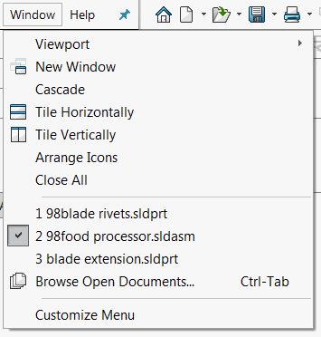

{ width=250 }

此宏利用SOLIDWORKS API关闭除活动文档外的所有已打开文档。

如果文档有未保存的更改（即脏文档），宏将提示用户为要关闭的文档指定操作（保存、不保存或取消）。否则，文档将被静默关闭。

观看[视频演示](https://youtu.be/9uZCecGg25I?t=166)

~~~ vb
#If VBA7 Then
     Private Declare PtrSafe Function SendMessage Lib "User32" Alias "SendMessageA" (ByVal hWnd As Long, ByVal wMsg As Long, ByVal wParam As Long, lParam As Any) As Long
#Else
     Private Declare Function SendMessage Lib "User32" Alias "SendMessageA" (ByVal hWnd As Long, ByVal wMsg As Long, ByVal wParam As Long, lParam As Any) As Long
#End If

Dim swApp As SldWorks.SldWorks

Sub main()

    Set swApp = Application.SldWorks
    
    Dim swModel As SldWorks.ModelDoc2
    
    Set swModel = swApp.ActiveDoc
    
    If Not swModel Is Nothing Then
        
        Dim vDocsWindows As Variant
        
        Dim swFrame As SldWorks.Frame
        Set swFrame = swApp.Frame
        
        vDocsWindows = swFrame.ModelWindows
        
        Dim i As Integer
        
        For i = 0 To UBound(vDocsWindows)
            
            Dim swDocWin As SldWorks.ModelWindow
            Set swDocWin = vDocsWindows(i)
            
            Dim swRefDoc As SldWorks.ModelDoc2
            Set swRefDoc = swDocWin.ModelDoc
            
            If Not swRefDoc Is swModel Then
                If swRefDoc.GetSaveFlag() Then
                    'display the close confirmation dialog for unsaved files
                    swApp.ActivateDoc3 swRefDoc.GetTitle, False, swRebuildOnActivation_e.swDontRebuildActiveDoc, 0
                    Const WM_COMMAND As Long = &H111
                    Const CMD_FileClose As Long = 57602
                    SendMessage swFrame.GetHWnd(), WM_COMMAND, CMD_FileClose, 0
                Else
                    swApp.CloseDoc swDocWin.ModelDoc.GetTitle
                End If
                
            End If
        Next
        
        swApp.ActivateDoc3 swModel.GetTitle, True, swRebuildOnActivation_e.swUserDecision, 0
        
    End If
    
End Sub
~~~

