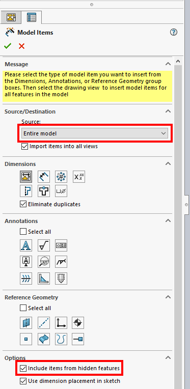
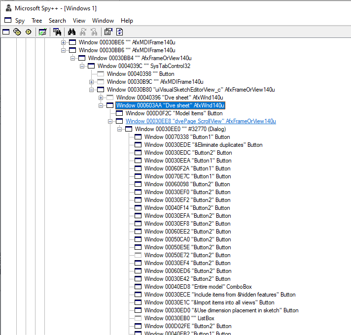

在某些情况下，某些SOLIDWORKS功能或选项可能无法在SOLIDWORKS API命令中使用或可能无法正常工作。

在这种情况下，如果其他解决方法不可用，可以使用Windows API来调用和配置命令。

此示例演示了如何使用Windows API将模型尺寸插入到SOLIDWORKS绘图视图中。此示例模拟了[IDrawingDoc::InsertModelAnnotations3](https://help.solidworks.com/2015/english/api/sldworksapi/solidworks.interop.sldworks~solidworks.interop.sldworks.idrawingdoc~insertmodelannotations3.html) API方法的功能。

{ width=400 }

这是一个C#控制台应用程序，它接受绘图文件的路径作为输入参数。将执行以下步骤：

* 连接或创建SOLIDWORKS的新实例
* 打开指定的绘图文件
* 使用SOLIDWORKS API运行命令打开**插入模型项**属性管理器页面
* 迭代所有控件，并将源设置为**整个模型**和**包括隐藏特征的项**选项
* 点击确定按钮关闭属性管理器页面
* 保存并关闭文档

在调用Windows API时，需要开发一种查找特定控件和命令ID的策略。

Microsoft内置在Visual Studio中的Spy++实用程序可以是分析Windows控件的有用工具：

{ width=400 }

有关此方法的更多信息，请参阅[调用Windows API命令](https://blog.codestack.net/missing-solidworks-api-command#calling-windows-command)博文。

## 限制

* 低级代码，可读性较差且更复杂
* 在某些情况下，控件没有永久ID，因此需要使用额外的逻辑，例如控件标题或顺序，这可能会因会话到会话、版本到版本或区域设置而异
* Windows API执行低级调用，因此在处理内存、释放指针等方面需要小心，否则可能会导致意外行为。阅读Windows API文档以获取有关特定API调用的更多信息
* 操作的结果没有反馈（仅有低级API结果），这意味着很难确定操作是否成功执行。操作还可能产生需要单独处理的模型弹出窗口。

~~~ cs
using SolidWorks.Interop.sldworks;
using SolidWorks.Interop.swconst;
using System;
using System.Collections.Generic;
using System.Linq;
using System.Runtime.InteropServices;
using System.Text;

namespace InsertModelItemsWinAPI
{
    class Program
    {
        public class SearchData
        {
            public string ClassName;
            public string Title;
            public List<IntPtr> Results;

            public SearchData()
            {
                Results = new List<IntPtr>();
            }
        }

        #region Windows API

        [DllImport("user32.dll", CharSet = CharSet.Auto)]
        private static extern int SendMessage(IntPtr hWnd, int msg, int wParam, int lParam);
        
        [DllImport("user32.dll", SetLastError = true, CharSet = CharSet.Auto)]
        public static extern int GetWindowTextLength(IntPtr hWnd);

        [DllImport("user32.dll", CharSet = CharSet.Auto, SetLastError = true)]
        public static extern int GetWindowText(IntPtr hWnd, StringBuilder lpString, int nMaxCount);

        [DllImport("user32.dll", SetLastError = true, CharSet = CharSet.Auto)]
        public static extern int GetClassName(IntPtr hWnd, StringBuilder lpClassName, int nMaxCount);

        public delegate bool WindowEnumProc(IntPtr hWnd, ref SearchData lParam);

        [DllImport("user32.dll")]
        public static extern bool EnumChildWindows(IntPtr hWnd, WindowEnumProc func, ref SearchData lParam);

        #endregion

        static void Main(string[] args)
        {
            var app = (ISldWorks)Activator.CreateInstance(Type.GetTypeFromProgID("SldWorks.Application"));

            int errs = -1;
            int warns = -1;

            var filePath = args.First();

            var doc = app.OpenDoc6(filePath, (int)swDocumentTypes_e.swDocDRAWING, (int)swOpenDocOptions_e.swOpenDocOptions_Silent, "", ref errs, ref warns);
            
            const int WM_COMMAND = 0x0111;
            const int MODEL_ITEMS_CMD = 38374;

            //get the handle to SOLIDWORKS window
            var hWnd = new IntPtr(app.IFrameObject().GetHWnd());

            //open 'Model Items' property manager page
            SendMessage(hWnd, WM_COMMAND, MODEL_ITEMS_CMD, 0);

            var modelItemPageWnd = FindPropertyPageByName(hWnd, "Model Items");

            //Find the check box 'Include items from hidden features'
            var includeHiddenItemsWnd = FindWindows(modelItemPageWnd, "Include items from &hidden features", "Button").First();

            //check the found checkbox
            SetCheckBox(includeHiddenItemsWnd, true);

            //Find the source ComboBox (this is a first ComboBox in the page)
            var srcComboBox = FindWindows(modelItemPageWnd, "", "ComboBox").First();

            //Set the ComboBox selection to the first item (Entire Model)
            SetComboBox(srcComboBox, 0);

            const int swCommands_PmOK = -2;

            //Click OK on the PMPage to complete the operation
            app.RunCommand(swCommands_PmOK, "");

            doc.Save3((int)swSaveAsOptions_e.swSaveAsOptions_Silent, ref errs, ref warns);
            app.CloseDoc(doc.GetTitle());
        }

        private static void SetCheckBox(IntPtr checkBoxWnd, bool value)
        {
            const int BST_UNCHECKED = 0x0000;
            const int BST_CHECKED = 0x0001;
            const int BM_SETCHECK = 0x00F1;

            SendMessage(checkBoxWnd, BM_SETCHECK, value ? BST_CHECKED : BST_UNCHECKED, 0);
        }

        private static void SetComboBox(IntPtr comboBoxWnd, int index) 
        {
            const int CB_SETCURSEL = 0x014E;
            SendMessage(comboBoxWnd, CB_SETCURSEL, index, 0);
        }

        private static IntPtr FindPropertyPageByName(IntPtr swHwnd, string name)
        {
            var pagesWnd = FindWindows(swHwnd, "Dve sheet", "AfxWnd140u");

            foreach (var pageWnd in pagesWnd) 
            {
                if (FindWindows(pageWnd, name, "Button").Any()) 
                {
                    return pageWnd;
                }
            }

            throw new Exception($"Failed to find the property page '{name}'");
        }

        private static IntPtr[] FindWindows(IntPtr parentWnd, string title, string className)
        {
            var data = new SearchData()
            {
                ClassName = className,
                Title = title
            };

            var callbackProc = new WindowEnumProc(EnumChildWindowsCallback);
            EnumChildWindows(parentWnd, callbackProc, ref data);

            return data.Results.ToArray();
        }

        private static bool EnumChildWindowsCallback(IntPtr hWnd, ref SearchData data)
        {
            GetWindowInfo(hWnd, out string title, out string className);

            if ((string.IsNullOrEmpty(data.ClassName) || className == data.ClassName) && (string.IsNullOrEmpty(data.Title) || title == data.Title))
            {
                data.Results.Add(hWnd);
            }

            return true;
        }

        private static void GetWindowInfo(IntPtr hWnd, out string title, out string className)
        {
            var length = GetWindowTextLength(hWnd);
            var sb = new StringBuilder(length + 1);
            
            GetWindowText(hWnd, sb, sb.Capacity);

            title = sb.ToString();

            sb = new StringBuilder(256);
            
            GetClassName(hWnd, sb, sb.Capacity);

            className = sb.ToString().Trim();
        }
    }
}
~~~

