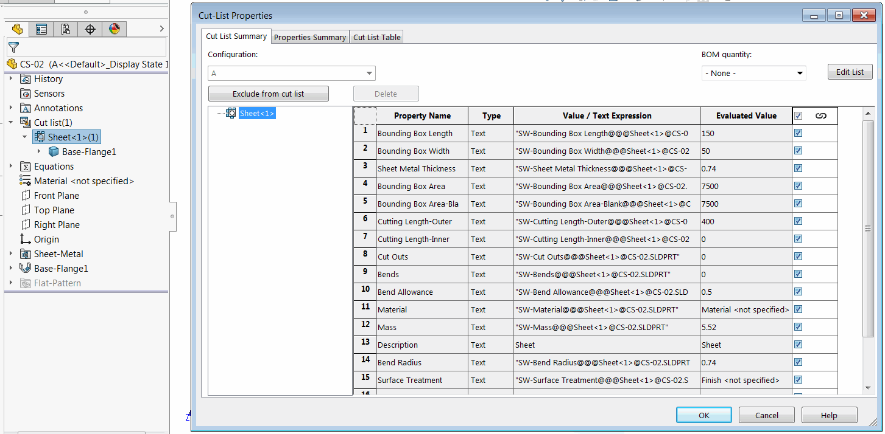

{ width=550 }

此VBA宏示例演示了如何使用SOLIDWORKS API从装配体中所选组件的所有切割清单元素中读取和打印所有自定义属性。

切割清单是从组件的相应引用配置中读取的。

结果以以下格式输出到VBA编辑器的即时窗口中。

~~~
CS-02-1 (A)
    Sheet<1>
        外包络盒长度：150
        外包络盒宽度：50
        钣金厚度：0.74
        外包络盒面积：7500
        空白外包络盒面积：7500
        外切长度：400
        内切长度：0
        切割数量：0
        弯曲数量：0
        弯曲补偿：0.5
        材料：未指定材料
        质量：5.52
        描述：钣金
        弯曲半径：0.74
        表面处理：未指定表面处理
        总成本：0
        数量：1
~~~

~~~ vb
Dim swApp As SldWorks.SldWorks

Sub main()

    Set swApp = Application.SldWorks
    
    Dim swModel As SldWorks.ModelDoc2
    Set swModel = swApp.ActiveDoc
    
    If Not swModel Is Nothing Then
        
        If swModel.GetType() = swDocumentTypes_e.swDocASSEMBLY Then
        
            Dim swSelMgr As SldWorks.SelectionMgr
            Set swSelMgr = swModel.SelectionManager
            
            Dim swComp As SldWorks.Component2
            Set swComp = swSelMgr.GetSelectedObjectsComponent2(1)
            
            If Not swComp Is Nothing Then
                PrintComponentCutListProperties swComp
            Else
                MsgBox "Please select component"
            End If
            
        Else
            MsgBox "Active document is not an assembly"
        End If
    Else
        MsgBox "Please open assembly"
    End If
    
End Sub

Sub PrintComponentCutListProperties(comp As SldWorks.Component2)
    
    Dim vCutLists As Variant
    vCutLists = GetCutLists(comp)
    
    Debug.Print comp.Name2 & " (" & comp.ReferencedConfiguration & ")"
    
    If Not IsEmpty(vCutLists) Then
    
        Dim i As Integer
        
        For i = 0 To UBound(vCutLists)
        
            Dim swCutListFeat As SldWorks.Feature
            Set swCutListFeat = vCutLists(i)
            Debug.Print "    " & swCutListFeat.Name
            
            Dim swCustPrpsMgr As SldWorks.CustomPropertyManager
            Set swCustPrpsMgr = swCutListFeat.CustomPropertyManager
            
            Dim vPrpNames As Variant
            Dim vPrpTypes As Variant
            Dim vPrpVals As Variant
            Dim vResVals As Variant
            Dim vPrpsLink As Variant
            
            Dim prpsCount As Integer
            prpsCount = swCustPrpsMgr.GetAll3(vPrpNames, vPrpTypes, vPrpVals, vResVals, vPrpsLink)
            
            Dim j As Integer
            
            Dim indent As String
            indent = "        "
            
            For j = 0 To prpsCount - 1
                Debug.Print indent & vPrpNames(j) & ": " & vPrpVals(j)
            Next
            
        Next
    Else
        Debug.Print "    -No Cut Lists-"
    End If
    
End Sub

Function GetCutLists(comp As SldWorks.Component2) As Variant
    
    Dim swCutListFeats() As SldWorks.Feature
    Dim isInit As Boolean
    isInit = False
    
    Dim swFeat As SldWorks.Feature
    Dim swBodyFolder As SldWorks.BodyFolder
    
    Set swFeat = comp.FirstFeature
    
    Do While Not swFeat Is Nothing
        
        If swFeat.GetTypeName2 = "CutListFolder" Then
            
            If Not isInit Then
                isInit = True
                ReDim swCutListFeats(0)
            Else
                ReDim Preserve swCutListFeats(UBound(swCutListFeats) + 1)
            End If
            
            Set swCutListFeats(UBound(swCutListFeats)) = swFeat
            
        End If
        
        Set swFeat = swFeat.GetNextFeature
        
    Loop
    
    If isInit Then
        GetCutLists = swCutListFeats
    Else
        GetCutLists = Empty
    End If

End Function
~~~

