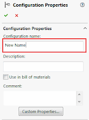

该宏使用SOLIDWORKS API将装配体或零件的所有配置重命名为指定配置特定自定义属性的值。

{ width=200 }

- 运行宏并输入要从中读取值的自定义属性的名称
- 宏将遍历所有配置并根据相应的配置特定自定义属性的值进行重命名
- 如果属性在配置中不存在或值为空，则不会重命名配置

~~~ vb
Dim swApp As SldWorks.SldWorks
Dim swModel As SldWorks.ModelDoc2

Sub main()

    Set swApp = Application.SldWorks
    
    Set swModel = swApp.ActiveDoc
    
    If Not swModel Is Nothing Then
        
        Dim prpName As String
        
        prpName = InputBox("Specify the property name to read the value from")
        
        If prpName <> "" Then
            
            Dim vConfNames As Variant
            Dim i As Integer
            
            vConfNames = swModel.GetConfigurationNames()
            
            For i = 0 To UBound(vConfNames)
                    
                Dim swConf As SldWorks.Configuration
                Set swConf = swModel.GetConfigurationByName(vConfNames(i))
                
                Dim prpVal As String
                
                If swConf.CustomPropertyManager.Get3(prpName, False, "", prpVal) Then
                    
                    If prpVal <> "" Then
                        swConf.Name = prpVal
                    End If
                    
                End If
                
            Next
            
        End If
        
    Else
        MsgBox "Please open the model"
    End If
    
End Sub
~~~

