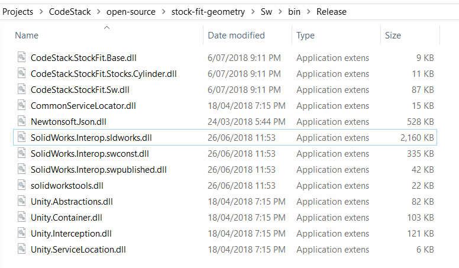
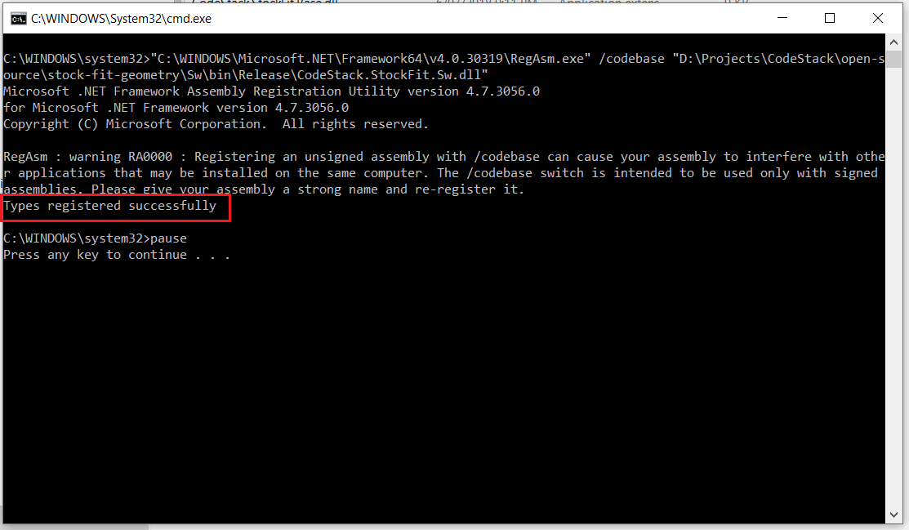
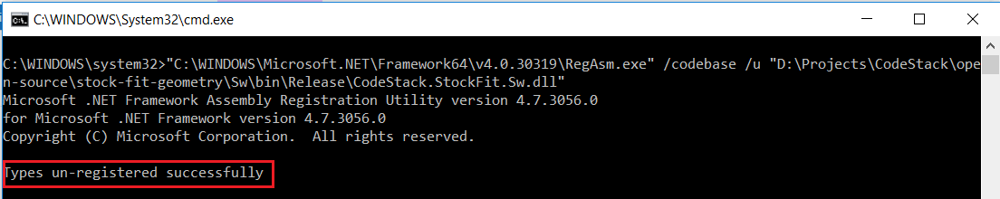

本文介绍如何手动部署和注册SOLIDWORKS插件。

### 部署二进制文件

项目成功编译后，所有所需的二进制文件和数据文件都会放置在输出文件夹中。

{ width=350 }

在部署产品（插件或独立应用程序）时，必须部署所有文件（包括任何第三方dll或interop文件）。可以排除任何支持文件，如pdb文件或xml文档文件。

### 注册插件

仅将文件复制到用户计算机上是不足以在目标系统上注册插件的。还需要注册插件的COM对象，并在注册表中添加相应的条目。

要注册.NET插件（C#或VB.NET），需要使用/regasm选项调用[程序集注册工具（regasm）](https://docs.microsoft.com/zh-cn/dotnet/framework/tools/regasm-exe-assembly-registration-tool)

> "%Windir%\Microsoft.NET\Framework64\v4.0.30319\regasm" /codebase "插件DLL文件的路径"

如果注册成功，将显示类似以下的消息：

{ width=500 }

> 必须根据插件编译的目标框架使用正确的框架版本。

要注册COM插件（C++），需要调用[regsvr32](https://docs.microsoft.com/zh-cn/windows-server/administration/windows-commands/regsvr32)实用程序。

> 注册通常需要以管理员身份运行[命令提示符](https://zh.wikipedia.org/wiki/Cmd.exe)。

对于独立应用程序，除非明确要求，否则不需要注册COM对象。

### 添加注册表信息

需要将有关插件的信息添加到注册表中，以便SOLIDWORKS可以正确加载插件。可以创建一个注册表文件，将此信息添加到注册表中。

添加到HKEY_LOCAL_MACHINE的键是必需的，并且用于在插件列表中显示插件。添加到HKEY_CURRENT_USER的键是可选的，并表示插件的启动状态。将值设置为1以在启动时加载插件，设置为0以在启动时不加载插件。

~~~ reg
Windows Registry Editor Version 5.00

[HKEY_LOCAL_MACHINE\SOFTWARE\SolidWorks\Addins\{a377433e-f7cf-4a5a-9d74-b64c0c1758c2}]
@=dword:00000001
"Description"="Sample add-in description"
"Title"="Sample add-in"

[HKEY_CURRENT_USER\Software\SolidWorks\AddInsStartup\{a377433e-f7cf-4a5a-9d74-b64c0c1758c2}]
@=dword:00000001
~~~

上述示例中使用的GUID是通过在插件类上设置[GuidAttribute](https://docs.microsoft.com/zh-cn/dotnet/api/system.runtime.interopservices.guidattribute?view=netframework-4.0)来设置的：

~~~ cs
[Guid("a377433e-f7cf-4a5a-9d74-b64c0c1758c2"), ComVisible(true)]
[SwAddin(Description = "示例插件", Title = "示例插件描述", LoadAtStartup = true)]    
public class MyAddIn : ISwAddin
{
    ...
}
~~~

作为替代选项，可以在将其注册为COM对象时，通过[ComRegisterFunctionAttribute](https://docs.microsoft.com/zh-cn/dotnet/api/system.runtime.interopservices.comregisterfunctionattribute?view=netframework-4.0)直接从dll中添加所需的注册表键。在这种情况下，上述步骤不是必需的：

~~~ cs
#region SolidWorks Registration

[ComRegisterFunction]
public static void RegisterFunction(Type t)
{
    try
    {
        var att = t.GetCustomAttributes(false).OfType<SwAddinAttribute>().FirstOrDefault();

        if (att == null)
        {
            throw new NullReferenceException($"{typeof(SwAddinAttribute).FullName} is not set on {t.GetType().FullName}");
        }

        Microsoft.Win32.RegistryKey hklm = Microsoft.Win32.Registry.LocalMachine;
        Microsoft.Win32.RegistryKey hkcu = Microsoft.Win32.Registry.CurrentUser;

        string keyname = "SOFTWARE\\SolidWorks\\Addins\\{" + t.GUID.ToString() + "}";
        Microsoft.Win32.RegistryKey addinkey = hklm.CreateSubKey(keyname);
        addinkey.SetValue(null, 0);

        addinkey.SetValue("Description", att.Description);
        addinkey.SetValue("Title", att.Title);

        keyname = "Software\\SolidWorks\\AddInsStartup\\{" + t.GUID.ToString() + "}";
        addinkey = hkcu.CreateSubKey(keyname);
        addinkey.SetValue(null, Convert.ToInt32(att.LoadAtStartup), Microsoft.Win32.RegistryValueKind.DWord);
    }
    catch (Exception ex)
    {
        Console.WriteLine("Error while registering the addin: " + ex.Message);
    }
}

[ComUnregisterFunction]
public static void UnregisterFunction(Type t)
{
    try
    {
        Microsoft.Win32.RegistryKey hklm = Microsoft.Win32.Registry.LocalMachine;
        Microsoft.Win32.RegistryKey hkcu = Microsoft.Win32.Registry.CurrentUser;

        string keyname = "SOFTWARE\\SolidWorks\\Addins\\{" + t.GUID.ToString() + "}";
        hklm.DeleteSubKey(keyname);

        keyname = "Software\\SolidWorks\\AddInsStartup\\{" + t.GUID.ToString() + "}";
        hkcu.DeleteSubKey(keyname);
    }
    catch (Exception e)
    {
        Console.WriteLine("Error while unregistering the addin: " + e.Message);
    }
}

#endregion
~~~

### 注销插件

要注销.NET插件，需要使用/u选项调用[程序集注册工具（regasm）](https://docs.microsoft.com/zh-cn/dotnet/framework/tools/regasm-exe-assembly-registration-tool)

> "%Windir%\Microsoft.NET\Framework64\v4.0.30319\regasm" /u /codebase "插件DLL文件的路径"

当插件注销成功时，控制台将显示以下消息：

{ width=500 }

要注销COM插件，需要使用/u标志调用[regsvr32](https://docs.microsoft.com/zh-cn/windows-server/administration/windows-commands/regsvr32)实用程序。

要清除注册表值（除非通过[ComUnregisterFunctionAttribute](https://docs.microsoft.com/zh-cn/dotnet/api/system.runtime.interopservices.comunregisterfunctionattribute?view=netframework-4.0)完成），请调用以下注册表文件：

~~~ reg
Windows Registry Editor Version 5.00

[-HKEY_LOCAL_MACHINE\SOFTWARE\SolidWorks\Addins\{a377433e-f7cf-4a5a-9d74-b64c0c1758c2}]
@=dword:00000001
"Description"="Sample add-in description"
"Title"="Sample add-in"

[-HKEY_CURRENT_USER\Software\SolidWorks\AddInsStartup\{a377433e-f7cf-4a5a-9d74-b64c0c1758c2}]
@=dword:00000001
~~~

### 最佳实践

可以将注册和注销命令放入单个批处理文件中，以简化注册和注销过程：

*Register.bat*
~~~ cmd
"%windir%\Microsoft.NET\Framework64\v4.0.30319\RegAsm.exe" /codebase "%~dp0CodeStack.StockFit.Sw.dll"
regedit.exe /S %~dp0add-registry.reg
pause
~~~

*Unregister.bat*
~~~ cmd
"%windir%\Microsoft.NET\Framework64\v4.0.30319\RegAsm.exe" /codebase /u "%~dp0CodeStack.StockFit.Sw.dll"
regedit.exe /S %~dp0remove-registry.reg
pause
~~~

更改插件的名称，并将这些文件放入bin文件夹中，只需在客户机上运行此批处理文件即可。