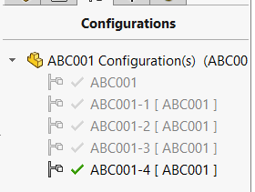

这个VBA宏将生成一系列与模型的材料变体相对应的配置。

宏将根据文件名和指定的后缀为配置分配名称。

宏将创建一个配置特定的属性，该属性基于文件特定的属性和颜色的名称。

宏不会生成新的显示状态，并假设选择了“将显示状态链接到配置颜色”选项，因此显示状态附加到配置。

## 配置

指定要创建的属性的名称

~~~ vb
Const PRP_NAME As String = "描述"
~~~

通过修改**CONFIGS_DATA**数组来配置配置的输入参数

将数组的大小设置为总实例数减1，例如5个实例的情况下为4，1个实例的情况下为0

~~~ vb
Dim CONFIGS_DATA(0) As ConfigData

CONFIGS_DATA(0).colorName = "我的颜色"
CONFIGS_DATA(0).ConfigNameSuffix = "-9"
CONFIGS_DATA(0).MaterialFilePath = "D:\my-color.p2m"
~~~

* colorName - 要写入自定义属性的颜色名称后缀
* ConfigNameSuffix - 配置的后缀名称，可以为空（在这种情况下，配置将以文件名命名）
* MaterialFilePath - 应用的外观的*.p2m*文件的完整路径。如果为空，则保留当前外观

宏将为从第二个开始的所有实例创建新的配置。第一个实例将被跳过，并且活动配置将用于该过程（例如重命名和上色）。

~~~ vb
Type ConfigData
    MaterialFilePath As String
    ConfigNameSuffix As String
    colorName As String
End Type

Const PRP_NAME As String = "Description"

Dim swApp As SldWorks.SldWorks

Sub main()
    
    Dim CONFIGS_DATA(4) As ConfigData

    CONFIGS_DATA(0).colorName = "Unpainted"
    CONFIGS_DATA(0).ConfigNameSuffix = "-9"
    CONFIGS_DATA(0).MaterialFilePath = ""

    CONFIGS_DATA(1).colorName = "RED"
    CONFIGS_DATA(1).ConfigNameSuffix = ""
    CONFIGS_DATA(1).MaterialFilePath = "C:\Program Files\SOLIDWORKS Corp\SOLIDWORKS\data\graphics\Materials\red.p2m"

    CONFIGS_DATA(2).colorName = "GREEN"
    CONFIGS_DATA(2).ConfigNameSuffix = "-1"
    CONFIGS_DATA(2).MaterialFilePath = "C:\Program Files\SOLIDWORKS Corp\SOLIDWORKS\data\graphics\Materials\green.p2m"

    CONFIGS_DATA(3).colorName = "BLUE"
    CONFIGS_DATA(3).ConfigNameSuffix = "-2"
    CONFIGS_DATA(3).MaterialFilePath = "C:\Program Files\SOLIDWORKS Corp\SOLIDWORKS\data\graphics\Materials\blue.p2m"

    CONFIGS_DATA(4).colorName = "YELLOW"
    CONFIGS_DATA(4).ConfigNameSuffix = "-3"
    CONFIGS_DATA(4).MaterialFilePath = "C:\Program Files\SOLIDWORKS Corp\SOLIDWORKS\data\graphics\Materials\yellow.p2m"

    Set swApp = Application.SldWorks
    
    Dim swModel As SldWorks.ModelDoc2
    
    Set swModel = swApp.ActiveDoc
    
    Dim i As Integer
    
    For i = 0 To UBound(CONFIGS_DATA)
        
        Dim confName As String
        
        confName = GetFileNameWithoutExtension(swModel.GetPathName())
        
        If CONFIGS_DATA(i).ConfigNameSuffix <> "" Then
            confName = confName & CONFIGS_DATA(i).ConfigNameSuffix
        End If
        
        If i <> 0 Then
            swModel.AddConfiguration3 confName, "", "", 0
        End If
        
        swModel.ConfigurationManager.ActiveConfiguration.Name = confName
        
        If CONFIGS_DATA(i).MaterialFilePath <> "" Then
            AddRenderMaterial swModel, CONFIGS_DATA(i).MaterialFilePath
        End If
        
        AddConfigProperty swModel, CONFIGS_DATA(i).colorName
        
    Next

End Sub

Sub AddRenderMaterial(model As SldWorks.ModelDoc2, path As String)
    
    Dim swRenderMaterial As SldWorks.RenderMaterial
    Set swRenderMaterial = model.Extension.CreateRenderMaterial(path)
    
    If False <> swRenderMaterial.AddEntity(model) Then
        If False = model.Extension.AddDisplayStateSpecificRenderMaterial(swRenderMaterial, swDisplayStateOpts_e.swThisDisplayState, Empty, -1, -1) Then
            Err.Raise vbError, "", "Failed to apply render material to display state"
        End If
    Else
        Err.Raise vbError, "", "Failed to add model as entity to render material"
    End If
   
End Sub

Sub AddConfigProperty(model As SldWorks.ModelDoc2, colorName As String)
    
    Dim swCustPrpMgr As SldWorks.CustomPropertyManager
    
    Set swCustPrpMgr = model.Extension.CustomPropertyManager("")
    
    Dim prpVal As String
    
    swCustPrpMgr.Get4 PRP_NAME, False, "", prpVal
    
    Set swCustPrpMgr = model.ConfigurationManager.ActiveConfiguration.CustomPropertyManager
    
    swCustPrpMgr.Add3 PRP_NAME, swCustomInfoType_e.swCustomInfoText, prpVal & " - " & colorName, swCustomPropertyAddOption_e.swCustomPropertyReplaceValue

End Sub

Function GetFileNameWithoutExtension(filePath As String) As String
    GetFileNameWithoutExtension = Mid(filePath, InStrRev(filePath, "\") + 1, InStrRev(filePath, ".") - InStrRev(filePath, "\") - 1)
End Function
~~~

