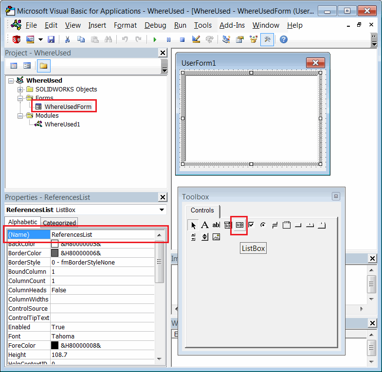

此VBA宏使用SOLIDWORKS API查找活动装配体中所选组件实例的所有父级组件（使用情况），并显示供审核的列表。

{ width=350 }

可以在表单中选择所有引用，并在特征管理器树中突出显示相应的组件。

## 配置

可以通过更改宏开头的常量参数来配置宏，如下所示：

~~~ vb
Const CONSIDER_CONFIG As Boolean = False 'True表示仅查找具有相同引用配置的组件，False表示仅按模型路径查找
Const INCLUDE_SUPPRESSED As Boolean = False 'True表示在搜索中包括被抑制的组件，False表示不包括
~~~

## 创建宏

* 创建新的宏
* 添加新的[用户窗体](/visual-basic/user-forms/)
* 将窗体命名为*WhereUsedForm*
* 将ListBox控件拖放到窗体上
* 将ListBox控件命名为*ReferencesList*

{ width=550 }

将代码放入相应的模块中

### 宏

~~~ vb
Const CONSIDER_CONFIG As Boolean = False
Const INCLUDE_SUPPRESSED As Boolean = False

Dim swApp As SldWorks.SldWorks

Sub main()

    Set swApp = Application.SldWorks
    
    Dim swAssy As SldWorks.AssemblyDoc
    
    Set swAssy = swApp.ActiveDoc
    
    If Not swAssy Is Nothing Then
        Dim swSelMgr As SldWorks.SelectionMgr
        Set swSelMgr = swAssy.SelectionManager
        
        Dim swComp As SldWorks.Component2
        Set swComp = swSelMgr.GetSelectedObjectsComponent3(1, -1)
        
        If Not swComp Is Nothing Then
        
            Dim vComps As Variant
            vComps = GetAllComponentInstances(swAssy, swComp, CONSIDER_CONFIG, INCLUDE_SUPPRESSED)
            
            If Not IsEmpty(vComps) Then
                Dim vParents As Variant
                vParents = GetParents(vComps)
                WhereUsedForm.Components = vParents
                Set WhereUsedForm.Assembly = swAssy
                WhereUsedForm.Show vbModeless
            Else
                MsgBox "Failed to find component instances"
            End If
            
        Else
            MsgBox "Please select component"
        End If
    Else
        MsgBox "Please open assembly"
    End If
    
End Sub

Function GetAllComponentInstances(assy As SldWorks.AssemblyDoc, targComp As SldWorks.Component2, considerConfig As Boolean, includeSuppressed As Boolean)
    
    Dim swCompInst() As SldWorks.Component2
    Dim isInit As Boolean
    
    Dim vComps As Variant
    vComps = assy.GetComponents(False)
    
    Dim i As Integer
    
    For i = 0 To UBound(vComps)
        
        Dim swComp As SldWorks.Component2
        Set swComp = vComps(i)
        
        If UCase(swComp.GetPathName()) = UCase(targComp.GetPathName()) Then
            
            If Not considerConfig Or UCase(swComp.ReferencedConfiguration) = UCase(targComp.ReferencedConfiguration) Then
                
                If includeSuppressed Or False = swComp.IsSuppressed() Then
                    
                    If isInit Then
                        ReDim Preserve swCompInst(UBound(swCompInst()) + 1)
                    Else
                        ReDim swCompInst(0)
                        isInit = True
                    End If
                    
                    Set swCompInst(UBound(swCompInst())) = swComp
                    
                End If
                
            End If
        End If
    Next
    
    If isInit Then
        GetAllComponentInstances = swCompInst
    Else
        GetAllComponentInstances = Empty
    End If
    
End Function

Function GetParents(comps As Variant) As Variant
    
    Dim swParents() As SldWorks.Component2
    Dim isInit As Variant
    
    Dim i As Integer
    
    For i = 0 To UBound(comps)
        
        Dim swComp As SldWorks.Component2
        Set swComp = comps(i)
        
        Dim swParentComp As SldWorks.Component2
        
        Set swParentComp = swComp.GetParent
        
        Dim addParent As Boolean
        addParent = True
        
        If Not isInit Then
            isInit = True
            ReDim swParents(0)
        Else
            If Not Contains(swParents, swParentComp) Then
                ReDim Preserve swParents(UBound(swParents) + 1)
            Else
                addParent = False
            End If
        End If
        
        If addParent Then
            Set swParents(UBound(swParents)) = swParentComp
        End If
        
    Next
    
    GetParents = swParents
    
End Function

Function Contains(vArr As Variant, item As Object) As Boolean
    
    Dim i As Integer
    
    For i = 0 To UBound(vArr)
        If vArr(i) Is item Then
            Contains = True
            Exit Function
        End If
    Next
    
    Contains = False
    
End Function
~~~

### WhereUsedForm

~~~ vb
Dim swComps As Variant

Public Assembly As SldWorks.AssemblyDoc

Property Let Components(val As Variant)
    swComps = val
    
    Dim i As Integer
    
    For i = 0 To UBound(swComps)
        
        Dim swComp As SldWorks.Component2
        Set swComp = swComps(i)
        
        Dim name As String
        
        If swComp Is Nothing Then
            name = "<root>"
        Else
            name = swComp.Name2
        End If
        
        ReferencesList.AddItem name
    Next
    
End Property

Private Sub ReferencesList_Change()

    Dim swComp As SldWorks.Component2
    Set swComp = swComps(ReferencesList.ListIndex)
        
    If Not swComp Is Nothing Then
        swComp.Select4 False, Nothing, False
    Else
        Assembly.ClearSelection2 False
    End If
        
End Sub
~~~

