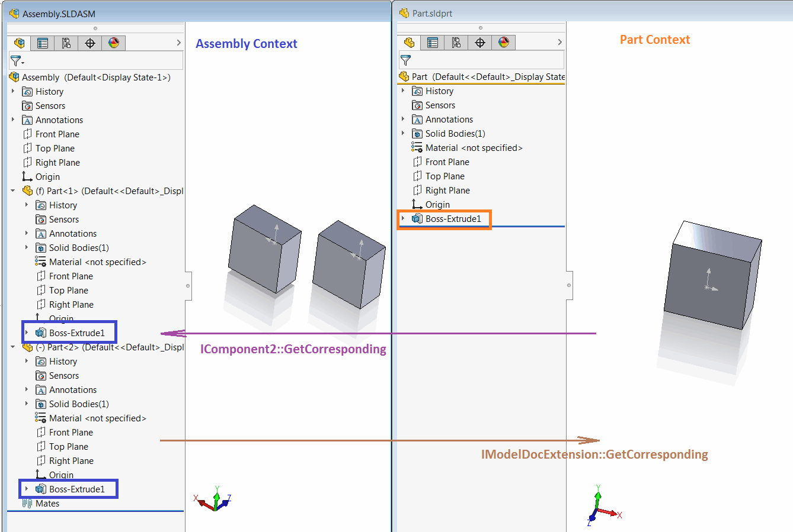
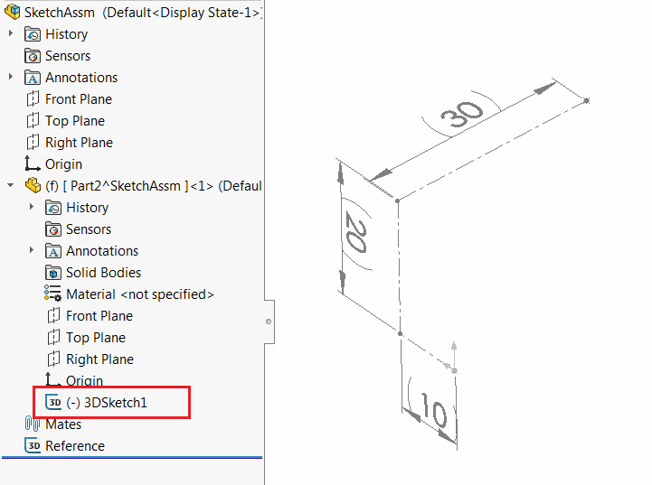
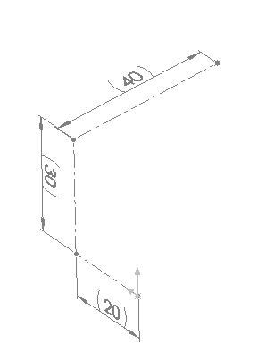
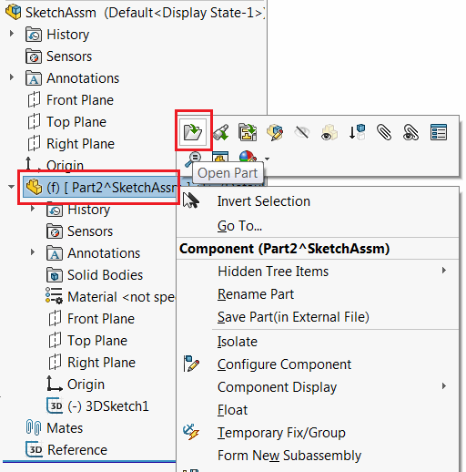
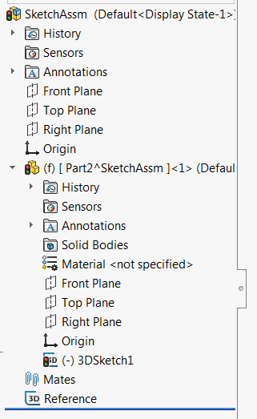

{ width=450 }

所有SOLIDWORKS 3D模型（零件和装配）中的实体可以在两个不同的上下文中呈现：

* 模型上下文 - 这是实体创建的上下文。例如在零件文档中创建的特征，零件中添加的尺寸。由凸台挤压特征生成的实体面
* 装配上下文 - 这是模型（以及所有实体）被实例化的上下文。例如，同一个零件可以在装配中添加两次，因此该零件的元素在装配中会有两组不同的指针，对应于相应的组件。

在使用SOLIDWORKS API处理元素时，使用正确的上下文非常重要。当进行装配上下文编辑时，必须在装配上下文中提供所有指针。

## 在装配上下文中向零件添加特征

在编辑或添加特征树中的新特征时，始终需要使用指向活动装配文档的指针（[ISldWorks::ActiveDoc](https://help.solidworks.com/2012/english/api/sldworksapi/solidworks.interop.sldworks~solidworks.interop.sldworks.isldworks~activedoc.html)），即使组件处于编辑状态。

例如，要将上述图像中正在上下文中编辑的零件文档中的挤压特征插入到零件文档中，必须在正在编辑的模型组件上调用 [IFeatureManager::FeatureExtrusion2](https://help.solidworks.com/2012/english/api/sldworksapi/SolidWorks.Interop.sldworks~SolidWorks.Interop.sldworks.IFeatureManager~FeatureExtrusion2.html)，该组件是活动装配的一部分，而不是正在编辑的组件的模型。

~~~ vb
Dim swApp As SldWorks.SldWorks

Sub main()

    Set swApp = Application.SldWorks

    Dim swAssy As SldWorks.AssemblyDoc
    
    Set swAssy = swApp.ActiveDoc
    
    If Not swAssy Is Nothing Then
        
        Dim swComp As SldWorks.Component2
        
        swAssy.InsertNewVirtualPart Nothing, swComp
        
        swComp.Select4 False, Nothing, False
        
        swAssy.EditPart
        
        Debug.Assert swComp.GetModelDoc2() Is swAssy.GetEditTarget() 'current editing model equals to the component's model
        Debug.Assert Not swComp.GetModelDoc2() Is swAssy 'component's model doesn't equal to the assembly model
        
        Dim swRefPlaneFeat As SldWorks.Feature
        Set swRefPlaneFeat = FindStandardPlane(swComp)
        
        Dim swSketchFeat As SldWorks.Feature
        
        'Creating circle in the context of the current editing model via the main assembly model
        Set swSketchFeat = CreateCircle(swRefPlaneFeat, swAssy)
        
        'Creating extrude in the context of the current editing model via the main assembly model
        CreateExtrude swSketchFeat, swAssy
        
        swAssy.EditAssembly
        swAssy.EditRebuild
        
    Else
        MsgBox "Please open assembly"
    End If

End Sub

Function FindStandardPlane(comp As SldWorks.Component2) As SldWorks.Feature
    
    Dim swCompModel As SldWorks.ModelDoc2
    Set swCompModel = comp.GetModelDoc2
    
    Dim i As Integer
    i = 1
    Dim swRefPlaneFeat As SldWorks.Feature
    
    Do
        Set swRefPlaneFeat = swCompModel.FeatureByPositionReverse(i)
        i = i + 1
    Loop While swRefPlaneFeat.GetTypeName2() <> "RefPlane"
    
    'converting the pointer of the feature into the assembly context so it can be selected in the assembly
    Set FindStandardPlane = comp.GetCorresponding(swRefPlaneFeat)
    
End Function

Function CreateCircle(plane As SldWorks.Feature, model As SldWorks.ModelDoc2) As SldWorks.Feature
    
    plane.Select2 False, -1
    
    model.SketchManager.InsertSketch True
    model.SketchManager.AddToDB = True
    
    Set CreateCircle = model.SketchManager.ActiveSketch
    
    model.ClearSelection2 True
    model.SketchManager.CreateCircleByRadius 0, 0, 0, 0.01
    model.SketchManager.AddToDB = False
    
    model.ClearSelection2 True
    model.SketchManager.InsertSketch True
    
End Function

Sub CreateExtrude(sketch As SldWorks.Feature, model As SldWorks.ModelDoc2)
    
    sketch.Select2 False, 0
    
    model.FeatureManager.FeatureExtrusion2 True, False, False, 0, 0, 0.01, 0.01, False, False, False, False, 0, 0, False, False, False, False, True, True, True, 0, 0, False
    model.ClearSelection2 True
    
End Sub
~~~

## 转换指针

SOLIDWORKS API提供了在上下文之间转换指针的方法：

* [IModelDocExtension::GetCorresponding](https://help.solidworks.com/2012/english/api/sldworksapi/solidworks.interop.sldworks~solidworks.interop.sldworks.imodeldocextension~getcorresponding.html) 将指针从装配上下文转换为底层组件的模型上下文
* [IComponent2::GetCorresponding](https://help.solidworks.com/2012/english/api/sldworksapi/solidworks.interop.sldworks~solidworks.interop.sldworks.icomponent2~getcorresponding.html) 将指针从底层模型上下文转换为该组件的装配上下文。

## 在装配上下文中的模型操作

{ width=350 }

以下测试案例将演示在装配中使用上下文时的不同方法和结果。[下载示例装配](SketchAssm.SLDASM)。该装配由单个虚拟组件组成（也可以是外部组件）。其中包含一个名为 *3DSketch1* 的三维草图，其中包含组件模型中的一个点。为了简单起见，还添加了一个名为 *Reference* 的草图，用于显示当前点的坐标。

以下案例的目的是将三维草图中的点在装配中沿XYZ方向移动10毫米。

### 测试案例1：通过直接从装配上下文获取指针进行移动

当打开装配时，直接从装配或组件中检索到的任何对象的指针都将具有活动装配上下文。

例如：

* 从组件中选择的对象（例如面或特征）的 [ISelectionMgr::GetSelectedObject6](https://help.solidworks.com/2012/english/api/sldworksapi/solidworks.interop.sldworks~solidworks.interop.sldworks.iselectionmgr~getselectedobject6.html) 在当前装配中有效
* [IComponent2::FirstFeature](https://help.solidworks.com/2012/english/api/sldworksapi/solidworks.interop.sldworks~solidworks.interop.sldworks.icomponent2~firstfeature.html) 返回组件模型中第一个特征的指针，在装配的上下文中。

在这些指针内部的装配上下文中工作是安全的。例如，可以更改面的颜色，重命名特征，修改点的坐标。

* 打开下载的示例装配
* 在树中选择 *3DSketch1* 特征
* 运行以下宏

~~~ vb
Dim swApp As SldWorks.SldWorks

Sub main()

    Set swApp = Application.SldWorks
    
    Dim swAssy As SldWorks.AssemblyDoc
    
    Set swAssy = swApp.ActiveDoc
    
    If Not swAssy Is Nothing Then
    
        Dim swFeat As SldWorks.Feature
        Set swFeat = swAssy.SelectionManager.GetSelectedObject6(1, -1)
        
        MoveSketchPoints swFeat, swAssy
    
        'exit edit in context model
        swAssy.ClearSelection2 True
        swAssy.EditAssembly
        
    Else
        MsgBox "Please open assembly document"
    End If
    
End Sub

Sub MoveSketchPoints(sketchFeat As SldWorks.Feature, editModel As SldWorks.ModelDoc2)
    
    Dim swSketch As SldWorks.Sketch
    Set swSketch = sketchFeat.GetSpecificFeature2
    
    Debug.Print "Sketch Feature Selected: " & sketchFeat.Select2(False, -1)
    
    editModel.SketchManager.Insert3DSketch True
    
    Dim vSkPts As Variant
    vSkPts = swSketch.GetSketchPoints2()
    
    Dim i As Integer
    
    For i = 0 To UBound(vSkPts)
        Dim swSkPt As SldWorks.SketchPoint
        Set swSkPt = vSkPts(i)
        swSkPt.X = swSkPt.X + 0.01
        swSkPt.Y = swSkPt.Y + 0.01
        swSkPt.Z = swSkPt.Z + 0.01
    Next
    
    editModel.SketchManager.Insert3DSketch True
    
End Sub
~~~

结果是，草图点在XYZ方向上移动了10毫米。

{ width=250 }

### 测试案例2：在装配上下文中访问底层模型上下文中的对象

并非总是可以直接从装配上下文中检索所需对象的指针。如果在装配上下文中使用上下文之外的对象（即检索或转换为底层组件的模型的对象），可能会产生意外的结果。

> 使用上下文之外的对象相当于在不可见模型上调用API。在某些情况下，这将产生正确的行为，但在某些情况下可能会失败，甚至导致崩溃。

以下示例演示了通过将上下文从装配转换为底层文档的结果，使用了上下文之外的指针，通过 [IModelDocExtension::GetCorresponding](https://help.solidworks.com/2012/english/api/sldworksapi/solidworks.interop.sldworks~solidworks.interop.sldworks.imodeldocextension~getcorresponding.html) 方法进行转换。

按照上一个测试案例的步骤操作，并运行以下宏

~~~ vb
Dim swApp As SldWorks.SldWorks

Sub main()

    Set swApp = Application.SldWorks
    
    Dim swAssy As SldWorks.AssemblyDoc
    
    Set swAssy = swApp.ActiveDoc
    
    If Not swAssy Is Nothing Then
    
        Dim swFeat As SldWorks.Feature
        Set swFeat = swAssy.SelectionManager.GetSelectedObject6(1, -1)
        
        Dim swComp As SldWorks.Component2
        Set swComp = swFeat.GetComponent
    
        Dim swCorrFeat As SldWorks.Feature
        Dim swCompModel As SldWorks.ModelDoc2
        Set swCompModel = swComp.GetModelDoc2
        Set swCorrFeat = swCompModel.Extension.GetCorresponding(swFeat)
        
        Dim swCorrFeatByName As SldWorks.Feature
        Set swCorrFeatByName = swCompModel.FeatureByName(swFeat.Name)
        
        Debug.Print "Pointers are equal: " & (swCorrFeat Is swCorrFeatByName)
        
        MoveSketchPoints swCorrFeat, swCompModel
        
    Else
        MsgBox "Please open assembly document"
    End If
    
End Sub

Sub MoveSketchPoints(sketchFeat As SldWorks.Feature, editModel As SldWorks.ModelDoc2)
    
    Dim swSketch As SldWorks.Sketch
    Set swSketch = sketchFeat.GetSpecificFeature2
    
    Debug.Print "Sketch Feature Selected: " & sketchFeat.Select2(False, -1)
    
    editModel.SketchManager.Insert3DSketch True
    
    Dim vSkPts As Variant
    vSkPts = swSketch.GetSketchPoints2()
    
    Dim i As Integer
    
    For i = 0 To UBound(vSkPts)
        Dim swSkPt As SldWorks.SketchPoint
        Set swSkPt = vSkPts(i)
        swSkPt.X = swSkPt.X + 0.01
        swSkPt.Y = swSkPt.Y + 0.01
        swSkPt.Z = swSkPt.Z + 0.01
    Next
    
    editModel.SketchManager.Insert3DSketch True
    
End Sub
~~~

结果是，尽管输出窗口显示成功，但草图点未移动。

{ width=250 }

这种行为的原因是，如果未在其自己的窗口中打开模型，则无法编辑草图。

现在，在其自己的窗口中打开组件

{ width=250 }

激活装配并重新运行宏。现在显示了稍微不同的结果。组件被标记为已修改并需要重建。如果重新构建模型，则草图相应更新。

{ width=200 }

### 测试案例3：转换对象的上下文

在许多情况下，初始指针在底层模型的上下文中是可用的。如果需要在装配上下文中进行修改，则需要通过 [IComponent2::GetCorresponding](https://help.solidworks.com/2012/english/api/sldworksapi/solidworks.interop.sldworks~solidworks.interop.sldworks.icomponent2~getcorresponding.html) 方法将指针转换为上下文。

* 关闭所有模型并重新打开示例装配
* 在其自己的窗口中打开零件组件。

{ width=250 }

* 在活动零件文档中选择 *3DSketch1*
* 运行以下宏

~~~ vb
Dim swApp As SldWorks.SldWorks

Sub main()

    Set swApp = Application.SldWorks
    
    Dim swModel As SldWorks.ModelDoc2
    
    Set swModel = swApp.ActiveDoc
    
    If Not swModel Is Nothing Then
    
        Dim swFeat As SldWorks.Feature
        Set swFeat = swModel.SelectionManager.GetSelectedObject6(1, -1)
        
        Stop 'Activate assembly and select the component
        
        Dim swAssy As SldWorks.AssemblyDoc
        Set swAssy = swApp.ActiveDoc
        
        Dim swComp As SldWorks.Component2
        Set swComp = swAssy.SelectionManager.GetSelectedObjectsComponent4(1, -1)
        Dim swCompFeat As SldWorks.Feature
        Set swCompFeat = swComp.GetCorresponding(swFeat)
        
        Dim swCompFeatByName As SldWorks.Feature
        Set swCompFeatByName = swComp.FeatureByName(swFeat.Name)
        
        Debug.Print "Pointers are equal: " & (swCompFeat Is swCompFeatByName)
        
        MoveSketchPoints swCompFeat, swAssy
        
    Else
        MsgBox "Please open assembly document"
    End If
    
End Sub

Sub MoveSketchPoints(sketchFeat As SldWorks.Feature, editModel As SldWorks.ModelDoc2)
    
    Dim swSketch As SldWorks.Sketch
    Set swSketch = sketchFeat.GetSpecificFeature2
    
    Debug.Print "Sketch Feature Selected: " & sketchFeat.Select2(False, -1)
    
    editModel.SketchManager.Insert3DSketch True
    
    Dim vSkPts As Variant
    vSkPts = swSketch.GetSketchPoints2()
    
    Dim i As Integer
    
    For i = 0 To UBound(vSkPts)
        Dim swSkPt As SldWorks.SketchPoint
        Set swSkPt = vSkPts(i)
        swSkPt.X = swSkPt.X + 0.01
        swSkPt.Y = swSkPt.Y + 0.01
        swSkPt.Z = swSkPt.Z + 0.01
    Next
    
    editModel.SketchManager.Insert3DSketch True
    
End Sub
~~~

* 宏停止执行
* 激活装配（可以只关闭零件文档）
* 选择组件并继续运行宏

宏将转换上下文并更改坐标，以便可以在装配上下文中成功更新坐标。

## 总结

* 在装配上下文中添加或编辑组件的特征时，调用 [IAssemblyDoc::EditPart2](https://help.solidworks.com/2017/english/api/sldworksapi/solidworks.interop.sldworks~solidworks.interop.sldworks.iassemblydoc~editpart2.html)/[IAssemblyDoc::EditAssembly](https://help.solidworks.com/2017/english/api/sldworksapi/solidworks.interop.sldworks~solidworks.interop.sldworks.iassemblydoc~editassembly.html) 来开始/结束编辑组件的上下文

* 不需要显式设置“编辑上下文”状态以执行某些操作（例如编辑草图点的位置，删除特征等）。行为与用户界面行为相匹配（即如果需要调用“编辑零件”命令执行某些操作，则需要调用相应的API）

* 不要使用组件的底层模型的指针（[IComponent2::GetModelDoc2](https://help.solidworks.com/2017/english/api/sldworksapi/solidworks.interop.sldworks~solidworks.interop.sldworks.icomponent2~getmodeldoc2.html)）来执行当前编辑目标组件的操作。使用顶层文档的指针（即活动装配）

* 避免使用错误的上下文。这可能导致意外的行为。

* 在需要时使用 ::GetCorresponding 函数在上下文之间转换指针