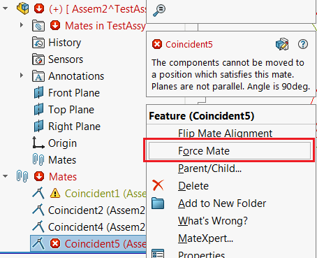

{ width=350 }

此示例演示了如何运行'Force Mate'命令以解决带有重建错误的约束。此宏基于Windows和SOLIDWORKS API的组合。

~~~ vb
#If VBA7 Then
     Private Declare PtrSafe Function SendMessage Lib "User32" Alias "SendMessageA" (ByVal hWnd As Long, ByVal wMsg As Long, ByVal wParam As Long, lParam As Any) As Long
#Else
     Private Declare Function SendMessage Lib "User32" Alias "SendMessageA" (ByVal hWnd As Long, ByVal wMsg As Long, ByVal wParam As Long, lParam As Any) As Long
#End If
 
Dim swApp As SldWorks.SldWorks
 
Sub main()

    On Error Resume Next
    
    Set swApp = Application.SldWorks
    
    Dim swAssy As SldWorks.AssemblyDoc
    
    Set swAssy = swApp.ActiveDoc
    
    If Not swAssy Is Nothing Then
        
        Dim swMateFeat As SldWorks.Feature
        Set swMateFeat = swAssy.SelectionManager.GetSelectedObject6(1, -1)
        
        Dim swMate As SldWorks.Mate2
        Set swMate = swMateFeat.GetSpecificFeature2
        
        If Not swMate Is Nothing Then
            
            Dim isWarn As Boolean
            If swMateFeat.GetErrorCode2(isWarn) = swFeatureError_e.swFeatureErrorNone Or True = isWarn Then
                MsgBox "Force command is only applicable for the mate with rebuild errors"
            Else
                ForceMate swMate
            End If
            
        Else
            MsgBox "Please select mate"
        End If
    Else
       MsgBox "Please open assembly"
    End If
     
End Sub

Sub ForceMate(mate As SldWorks.Mate2)

    Dim swMateFeat As SldWorks.Feature
    Set swMateFeat = mate
    swMateFeat.Select2 False, -1
    
    Const WM_COMMAND As Long = &H111
    Const CMD_FORCE_MATE As Long = 13724
    
    Dim swFrame As SldWorks.Frame
        
    Set swFrame = swApp.Frame
        
    SendMessage swFrame.GetHWnd(), WM_COMMAND, CMD_FORCE_MATE, 0

End Sub
~~~

