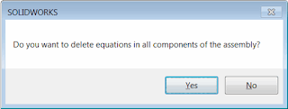

该宏可使用SOLIDWORKS API从活动模型（零件或装配）中删除所有方程式（或仅删除损坏的方程式）。

{ width=640 }

如果活动模型是装配体，则该宏可选择删除装配体的每个组件中的所有方程式。将显示以下消息。点击**是**以删除所有级别上的所有组件的方程式，点击**否**仅处理顶层装配体的方程式。

{ width=320 height=120 }

将*DELETE_BROKEN_ONLY*选项设置为*True*，以仅删除损坏（悬空）的方程式。

**重要提示：请自行承担使用该宏的风险。该宏会修改您的数据（删除所有方程式），请在运行该宏之前备份您的文件**

~~~ vb
Const DELETE_BROKEN_ONLY As Boolean = False 'if this flag is True than only broken equations are deleted, otherwise all equations are deleted

Dim swApp As SldWorks.SldWorks
Dim swModel As SldWorks.ModelDoc2
Dim swEqMgr As SldWorks.EquationMgr

Sub main()

    Set swApp = Application.SldWorks
    
try_:
    On Error GoTo catch_
    
    Set swModel = swApp.ActiveDoc
    
    Dim hasDeleted As Boolean
    
    DeleteEquationsFromModel swModel, hasDeleted
    
    If swModel.GetType = swDocumentTypes_e.swDocASSEMBLY Then
        
        If swApp.SendMsgToUser2("Do you want to delete equations in all components of the assembly?", swMessageBoxIcon_e.swMbQuestion, swMessageBoxBtn_e.swMbYesNo) = swMessageBoxResult_e.swMbHitYes Then
            
            Dim swAssy As SldWorks.AssemblyDoc
            Set swAssy = swModel
            
            'component needs to be loaded in memory in order to process it's equations
            swAssy.ResolveAllLightWeightComponents True
            
            Dim vComps As Variant
            vComps = swAssy.GetComponents(False)
            
            Dim i As Integer
            
            For i = 0 To UBound(vComps)
                
                Dim swComp As SldWorks.Component2
                Set swComp = vComps(i)
                
                Dim swCompModel As SldWorks.ModelDoc2
                
                Set swCompModel = swComp.GetModelDoc2
                
                If Not swCompModel Is Nothing Then
                    
                    Dim hasCompEqDeleted As Boolean
                    DeleteEquationsFromModel swCompModel, hasCompEqDeleted
                    
                    If hasCompEqDeleted Then
                        hasDeleted = True
                    End If
                    
                End If
                
            Next
            
        End If
        
    End If
    
    If hasDeleted Then
        swModel.ForceRebuild3 False
    End If
    
    GoTo finally_
    
catch_:
    swApp.SendMsgToUser2 Err.Description, swMessageBoxIcon_e.swMbStop, swMessageBoxBtn_e.swMbOk
finally_:
    
End Sub

Sub DeleteEquationsFromModel(model As SldWorks.ModelDoc2, ByRef hasDeleted As Boolean)
    
    Set swEqMgr = model.GetEquationMgr()
    
    Dim i As Integer
    
    hasDeleted = False
    
    'iterate in the reverse direction as the equation index will change once previous equation is deleted
    For i = swEqMgr.GetCount - 1 To 0 Step -1
        
        If Not DELETE_BROKEN_ONLY Or IsEquationBroken(swEqMgr, i) Then
            swEqMgr.Delete i
            hasDeleted = True
        End If
    Next
    
    If hasDeleted Then
        'deleting equation doesn't make the model dirty
        model.SetSaveFlag
    End If
    
End Sub

Function IsEquationBroken(eqMgr As SldWorks.EquationMgr, index As Integer) As Boolean
    
    Const STATUS_BROKEN As Integer = -1
    
    Dim val As String
    val = eqMgr.Value(index) 'evaluate to get the status
    
    IsEquationBroken = (eqMgr.Status = STATUS_BROKEN)
    
End Function

~~~

