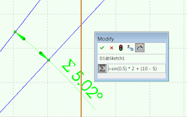

本示例将使用SOLIDWORKS API修改所选尺寸的值，并将其设置为等于方程的值：

> sin(0.5) * 2 + (10 - 5)

{ width=320 height=200 }

应使用[SOLIDWORKS API接口IEquationMgr](https://help.solidworks.com/2018/english/api/sldworksapi/SolidWorks.Interop.sldworks~SolidWorks.Interop.sldworks.IEquationMgr.html)来管理SOLIDWORKS文档中的方程。

~~~ vb
Dim swApp As SldWorks.SldWorks
Dim swModel As SldWorks.ModelDoc2
Dim swSelMgr As SldWorks.SelectionMgr
Dim swEqMgr As SldWorks.EquationMgr

Const EQUATION = "sin(0.5) * 2 + (10 - 5)"

Sub main()

    Set swApp = Application.SldWorks
    
    Set swModel = swApp.ActiveDoc
    
    If Not swModel Is Nothing Then
    
        Set swSelMgr = swModel.SelectionManager
        
        Dim swDispDim As SldWorks.DisplayDimension
        
        Set swDispDim = swSelMgr.GetSelectedObject6(1, -1)
                
        If Not swDispDim Is Nothing Then
                
            Set swEqMgr = swModel.GetEquationMgr
            
            Dim formula As String
            
            formula = """" & swDispDim.GetNameForSelection & """ = " & EQUATION
            
            swEqMgr.Add2 -1, formula, True
        
        Else
            MsgBox "Please select dimension"
        End If
    
    Else
        MsgBox "Please open model"
    End If
    
End Sub

~~~

