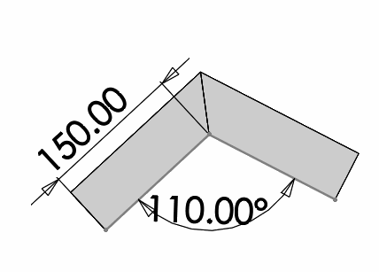

这个VBA宏演示了如何使用SOLIDWORKS API从活动SOLIDWORKS文档或组件（如果选择了组件）中遍历所有特征的尺寸。

宏将把尺寸名称和当前系统单位的值输出到VBA的即时窗口中。

~~~
D1@Sketch1=0.15
D2@Sketch1=2.0
RI@Sketch11=0.008
~~~

> 该宏将排除所有重复的尺寸，因为在某些情况下（例如焊接特征），同一个尺寸可能同时存在于草图和结构成员特征中。

~~~ vb
Dim swApp As SldWorks.SldWorks

Sub main()

    Set swApp = Application.SldWorks
    
    Dim swModel As SldWorks.ModelDoc2
    Set swModel = swApp.ActiveDoc
    
    If Not swModel Is Nothing Then
        
        Dim swSelMgr As SldWorks.SelectionMgr
        
        Set swSelMgr = swModel.SelectionManager
        
        Dim swComp As SldWorks.Component2
        
        Set swComp = swSelMgr.GetSelectedObjectsComponent3(1, -1)
        
        If Not swComp Is Nothing Then
            TraverseDimensions swComp.FirstFeature
        Else
            TraverseDimensions swModel.FirstFeature
        End If
        
    Else
        MsgBox "Please open document"
    End If
    
End Sub

Sub TraverseDimensions(startFeat As SldWorks.Feature)

    Dim vFeats As Variant
    vFeats = GetAllFeatures(startFeat)
    
    Dim vDispDims As Variant
    vDispDims = GetAllDimensions(vFeats)
    
    If Not IsEmpty(vDispDims) Then
    
        Dim i As Integer
        
        For i = 0 To UBound(vDispDims)
        
            Dim swDispDim As SldWorks.DisplayDimension
            Set swDispDim = vDispDims(i)
            
            Dim swDim As SldWorks.Dimension
            Set swDim = swDispDim.GetDimension2(0)
            
            Dim val As Double
            val = swDim.GetSystemValue3(swInConfigurationOpts_e.swThisConfiguration, Empty)(0)
            
            Debug.Print swDim.GetNameForSelection() & "=" & val
        
        Next
    
    End If

End Sub

Function GetAllDimensions(vFeats As Variant) As Variant
    
    Dim swDimsColl As Collection
    Set swDimsColl = New Collection
    
    Dim i As Integer
    
    For i = 0 To UBound(vFeats)
        
        Dim swFeat As SldWorks.Feature
        Set swFeat = vFeats(i)
        
        Dim swDispDim As SldWorks.DisplayDimension
        Set swDispDim = swFeat.GetFirstDisplayDimension
        
        While Not swDispDim Is Nothing
            
            If Not Contains(swDimsColl, swDispDim) Then
                swDimsColl.Add swDispDim
            End If
            
            Set swDispDim = swFeat.GetNextDisplayDimension(swDispDim)
        Wend
        
    Next

    GetAllDimensions = CollectionToArray(swDimsColl)
    
End Function

Function GetAllFeatures(startFeat As SldWorks.Feature) As Variant
        
    Dim swProcFeatsColl As Collection
    Set swProcFeatsColl = New Collection
    
    Dim swFeat As SldWorks.Feature
    Set swFeat = startFeat
    
    While Not swFeat Is Nothing
        
        If swFeat.GetTypeName2() <> "HistoryFolder" Then
        
            If Not Contains(swProcFeatsColl, swFeat) Then
                swProcFeatsColl.Add swFeat
            End If
        
            CollectAllSubFeatures swFeat, swProcFeatsColl
            
        End If
        
        Set swFeat = swFeat.GetNextFeature
        
    Wend
    
    GetAllFeatures = CollectionToArray(swProcFeatsColl)
    
End Function

Sub CollectAllSubFeatures(parentFeat As SldWorks.Feature, procFeatsColl As Collection)
    
    Dim swSubFeat As SldWorks.Feature
    Set swSubFeat = parentFeat.GetFirstSubFeature
        
    While Not swSubFeat Is Nothing
        
        If Not Contains(procFeatsColl, swSubFeat) Then
            procFeatsColl.Add swSubFeat
        End If
        
        CollectAllSubFeatures swSubFeat, procFeatsColl
        Set swSubFeat = swSubFeat.GetNextSubFeature
        
    Wend
    
End Sub

Function CollectionToArray(coll As Collection) As Variant
    
    If coll.Count() > 0 Then
        
        Dim arr() As Object
        
        ReDim arr(coll.Count() - 1)
        Dim i As Integer
        
        For i = 1 To coll.Count
            Set arr(i - 1) = coll(i)
        Next
        
        CollectionToArray = arr
        
    Else
        CollectionToArray = Empty
    End If
    
End Function

Function Contains(coll As Collection, item As Object) As Boolean
    
    Dim i As Integer
    
    For i = 1 To coll.Count
        If coll.item(i) Is item Then
            Contains = True
            Exit Function
        End If
    Next
    
    Contains = False
    
End Function
~~~

