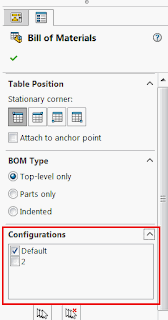
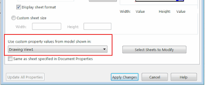

该宏将使用SOLIDWORKS API在活动绘图文档上更新所有BOM表的引用配置。

{ width=168 height=320 }

BOM表与绘图视图无关，即使视图被删除，BOM表仍将存在。
BOM表与视图的引用配置没有关联。因此，如果视图的引用配置发生更改，BOM表将不会更新。

该宏将查找所有BOM表，并根据工作表的默认视图更新它们的引用配置。

{ width=400 height=165 }

~~~ vb
Dim swApp As SldWorks.SldWorks
Dim swDraw As SldWorks.DrawingDoc

Sub main()

    Set swApp = Application.SldWorks
    
    Set swDraw = swApp.ActiveDoc
    
    Dim vSheetNames As Variant
    
    vSheetNames = swDraw.GetSheetNames
    
    Dim i As Integer
        
    For i = 0 To UBound(vSheetNames)
        
        Dim swSheet As SldWorks.Sheet
        Set swSheet = swDraw.Sheet(vSheetNames(i))
        
        Dim swView As SldWorks.View
        Set swView = GetPropertiesView(swSheet)
        
        Dim vBomFeatures As Variant
        vBomFeatures = GetBomFeatures(swSheet)
        ProcessView swView, vBomFeatures
        
    Next
    
End Sub

Sub ProcessView(swView As SldWorks.View, vBomFeatures As Variant)
    
    If Not IsEmpty(vBomFeatures) Then
        
        Dim i As Integer
        
        For i = 0 To UBound(vBomFeatures)
            
            Dim swBomFeat As SldWorks.BomFeature
            
            Set swBomFeat = vBomFeatures(i)
            
            Dim vConfVis As Variant
            Dim vConfNames As Variant
            vConfNames = swBomFeat.GetConfigurations(False, vConfVis)
            
            Dim visConfIndex As Integer
            
            Dim j As Integer
            
            For j = 0 To UBound(vConfNames)
                
                vConfVis(j) = UCase(vConfNames(j)) = UCase(swView.ReferencedConfiguration)
                                
            Next
            
            swBomFeat.SetConfigurations False, vConfVis, vConfNames
            
        Next
        
    End If
    
End Sub

Function GetBomFeatures(swSheet As SldWorks.Sheet) As Variant
    
    Dim vSheets As Variant
    vSheets = swDraw.GetViews()
    
    Dim i As Integer
    
    For i = 0 To UBound(vSheets)
    
        Dim vViews As Variant
        vViews = vSheets(i)
        
        Dim swSheetView As SldWorks.View
        Set swSheetView = vViews(0)
        
        If UCase(swSheetView.Name) = UCase(swSheet.GetName()) Then
            
            Dim swBomFeatures() As SldWorks.BomFeature
            
            Dim vTables As Variant
            vTables = swSheetView.GetTableAnnotations()
            
            Dim j As Integer
            Dim isArrInit As Boolean
            
            For j = 0 To UBound(vTables)
                
                Dim swTableAnn As SldWorks.TableAnnotation
                Set swTableAnn = vTables(j)
                
                If swTableAnn.Type = swTableAnnotationType_e.swTableAnnotation_BillOfMaterials Then
                    If False = isArrInit Then
                        isArrInit = True
                        ReDim swBomFeatures(0)
                    Else
                        ReDim Preserve swBomFeatures(UBound(swBomFeatures) + 1)
                    End If
                    
                    Dim swBomTableAnn As SldWorks.BomTableAnnotation
                    Set swBomTableAnn = swTableAnn
                    
                    Set swBomFeatures(UBound(swBomFeatures)) = swBomTableAnn.BomFeature
                    
                End If
                
            Next
            
            GetBomFeatures = swBomFeatures
            Exit Function
        End If
        
    Next
    
End Function

Function GetPropertiesView(swSheet As SldWorks.Sheet) As SldWorks.View
    
    Dim vViews As Variant
    
    vViews = swSheet.GetViews
    
    If Not IsEmpty(vViews) Then
        
        Dim i As Integer
        
        For i = 0 To UBound(vViews)
            
            Dim swView As SldWorks.View
            Set swView = vViews(i)
            
            If UCase(swView.Name) = UCase(swSheet.CustomPropertyView) Then
                Set GetPropertiesView = swView
                Exit Function
            End If
            
        Next
        
        Set GetPropertiesView = vViews(0) 'use first one
        
    End If
    
End Function

~~~

