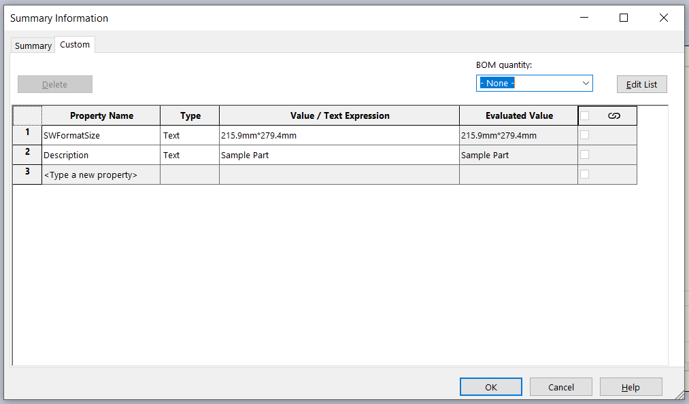
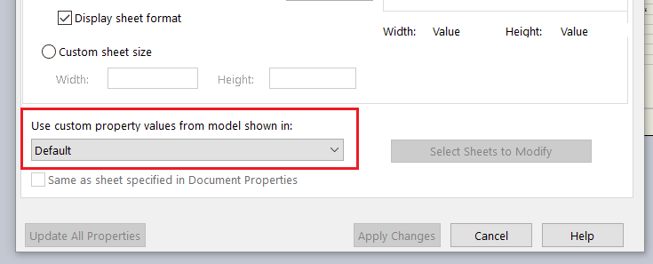

{ width=500 }

此宏将指定的自定义属性从绘图视图中引用的SOLIDWORKS零件或装配体复制到绘图视图本身。

可以在宏中的*PRP_NAMES*常量中指定自定义属性。使用逗号来指定要复制的多个属性。

~~~ vb
Const PRP_NAMES As String = "零件号,描述,标题"
~~~

为了在运行时选择要复制的属性，请将*PRP_NAMES*的值指定为空字符串。

~~~ vb
Const PRP_NAMES As String = ""
~~~

在这种情况下，将显示以下输入框。

用户可以指定单个属性或多个属性，用逗号分隔。

如果在运行宏时选择了绘图视图，则将从该绘图视图复制属性。否则，将使用工作表属性中指定的默认属性视图（通常是绘图中的第一个视图）：

{ width=500 }

首先，将从与绘图视图引用配置相对应的模型配置中提取自定义属性值。如果属性不存在或为空，则将提取文件特定的自定义属性。

~~~ vb
Const PRP_NAMES As String = "Description" 'comma separated, empty string for popup select

Dim swApp As SldWorks.SldWorks

Sub main()

    Set swApp = Application.SldWorks
        
    On Error GoTo catch
    
try:
    
    Dim swDraw As SldWorks.DrawingDoc
    
    Set swDraw = swApp.ActiveDoc
    
    If swDraw Is Nothing Then
        Err.Raise vbError, , "Please open the drawing"
    End If
    
    Dim vPrpNames As Variant
    vPrpNames = GetPropertyNames()
    
    Dim swPrpsView As SldWorks.view
    Set swPrpsView = GetPropertiesView(swDraw)
    
    If swPrpsView Is Nothing Then
        Err.Raise vbError, , "Failed to find the drawing view with properties"
    End If
    
    Dim i As Integer
    
    Dim swDrwPrpMgr As SldWorks.CustomPropertyManager
    Set swDrwPrpMgr = swDraw.Extension.CustomPropertyManager("")
    
    For i = 0 To UBound(vPrpNames)
        
        Dim prpName As String
        Dim prpVal As String
        
        prpName = vPrpNames(i)
        prpVal = GetPropertyValue(swPrpsView, prpName)
        
        swDrwPrpMgr.Add2 prpName, swCustomInfoType_e.swCustomInfoText, prpVal
        swDrwPrpMgr.Set prpName, prpVal
        
    Next
    
    GoTo finally
    
catch:
    swApp.SendMsgToUser2 Err.Description, swMessageBoxIcon_e.swMbStop, swMessageBoxBtn_e.swMbOk
finally:
    
End Sub

Function GetPropertyValue(view As SldWorks.view, prpName As String)
    
    Dim swViewDoc As SldWorks.ModelDoc2
    Set swViewDoc = view.ReferencedDocument
    
    If swViewDoc Is Nothing Then
        Err.Raise vbError, , "Cannot get document from the view. Make sure view is not empty and document is not lightweigh"
    End If

    Dim prpVal As String
          
    Dim swCustPrpMgr As SldWorks.CustomPropertyManager
    Set swCustPrpMgr = swViewDoc.Extension.CustomPropertyManager(view.ReferencedConfiguration)
    
    swCustPrpMgr.Get3 prpName, False, "", prpVal
    
    If prpVal = "" Then
        Set swCustPrpMgr = swViewDoc.Extension.CustomPropertyManager("")
        
        swCustPrpMgr.Get3 prpName, False, "", prpVal
    End If
    
    GetPropertyValue = prpVal
    
End Function

Function GetPropertyNames() As Variant
    
    Dim prpNames As String
    prpNames = PRP_NAMES
    
    If prpNames = "" Then
        prpNames = InputBox("Please specify comma separated custom property names to transfer to drawing")
    End If
    
    If prpNames = "" Then
        End
    End If
    
    Dim vPrpNames As Variant
    vPrpNames = Split(prpNames, ",")
    
    Dim i As Integer
    
    For i = 0 To UBound(vPrpNames)
        vPrpNames(i) = Trim(CStr(vPrpNames(i)))
    Next
    
    GetPropertyNames = vPrpNames
    
End Function

Function GetPropertiesView(draw As SldWorks.DrawingDoc) As SldWorks.view
    
    Dim swSelMgr As SldWorks.SelectionMgr
    Set swSelMgr = draw.SelectionManager
    
    Dim swCustPrpView As SldWorks.view
    Set swCustPrpView = swSelMgr.GetSelectedObjectsDrawingView2(1, -1)
    
    If Not swCustPrpView Is Nothing Then
        Set GetPropertiesView = swCustPrpView
        Exit Function
    End If
    
    Dim vSheetNames As Variant
    vSheetNames = draw.GetSheetNames
    
    Dim i As Integer
    
    For i = 0 To UBound(vSheetNames)
        
        Dim swSheet As SldWorks.Sheet
        Set swSheet = draw.Sheet(vSheetNames(i))
        
        Dim custPrpViewName As String
        custPrpViewName = swSheet.CustomPropertyView
        
        Dim vViews As Variant
        vViews = swSheet.GetViews()
        
        Dim j As Integer
        
        For j = 0 To UBound(vViews)
            
            Dim swView As SldWorks.view
            Set swView = vViews(j)
            
            If LCase(swView.Name) = LCase(custPrpViewName) Then
                Set swCustPrpView = swView
                Exit For
            End If
            
        Next
        
        If swCustPrpView Is Nothing Then
            Set swCustPrpView = vViews(0)
        End If
        
    Next
    
    Set GetPropertiesView = swCustPrpView
    
End Function
~~~

